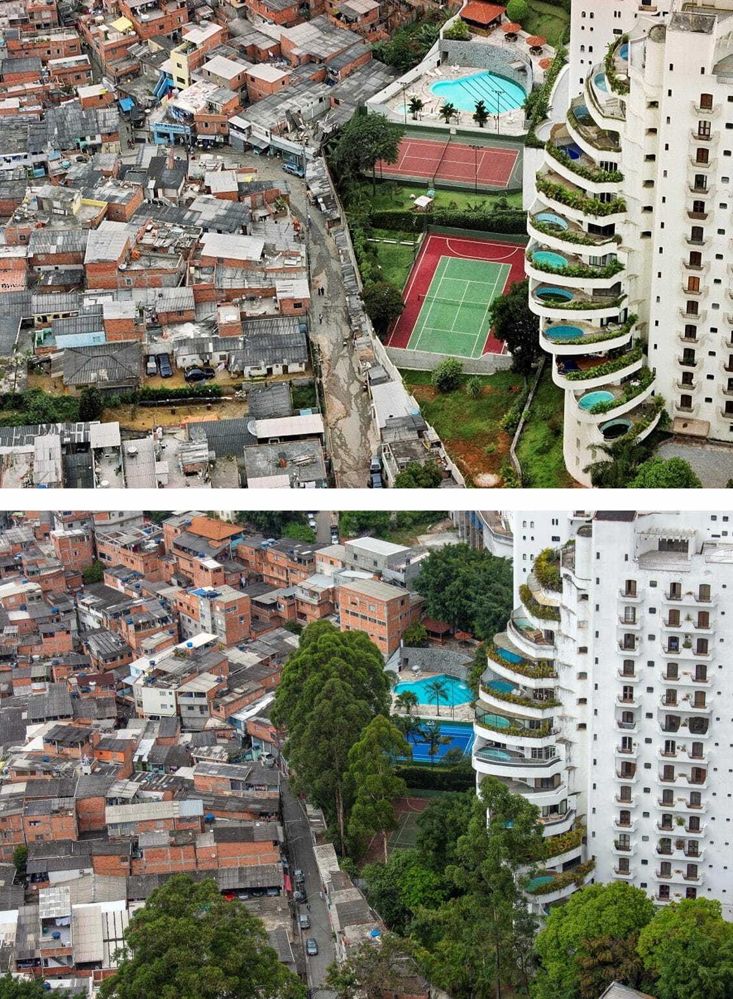

# SOL186S Sociología de la Desigualad
Este repositorio contiene el material del curso SOL186S Sociología de la Desigualad, dictado el segundo semestre 2022 a estudiantes de pregrado del Departamento de Sociología de la Universidad Católica de Chile. Para mayores detalles ver el [`[programa]`](files/syllabus.pdf) del curso.

---

## Calendario Clases

- Semana 00: Presentación del curso (10 de agosto):

- Semana 01: Aspectos normativos del debate: desigualdad de oportunidades y de resultados (17 de agosto):

- Semana 02:  Pobreza: conceptos y medición (24 de agosto):

- Semana 03: Pobreza: tendencias y debates (31 de agosto):

- Semana 04: Desigualdad económica: conceptos y medición  (7 de septiembre):

- Semana 05: Desigualdad económica: tendencias y debates  (14 de septiembre):

- Semana 06: Movilidad social: conceptos y medición   (21 de septiembre):

- Semana 07: Movilidad social: tendencias y debates (28 de septiembre):

- Semana 08: Desigualdad y movilidad  (5 de octubre):

- Semana 09: Creencias sobre la desigualdad (11 de octubre):

- Semana 09: Consecuencias de la desigualdad (19 de octubre):

- Semana 11: Redistribución y Estado de bienestar: antecedentes históricos (26 de octubre):

- Semana 12: Redistribución y Estado de bienestar: problemas contemporáneos (2 de noviembre):

- Semana 13: Redistribución y Estado de bienestar: La paradoja de la redistribución (9 de noviembre):

- Semana 14: Redistribución y Estado de bienestar: Preferencias redistributivas (16 de noviembre):

- Semana 15: Cierre (23 de noviembre):

---

## Evaluaciones

#### Tareas

- Asignación Trabajo 1: 
- Asignación Trabajo 2: 

#### Trabajo Final

- Asignación Trabajo final: 

