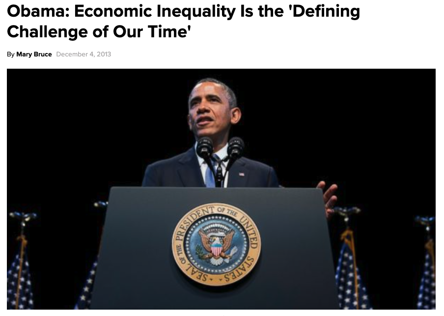
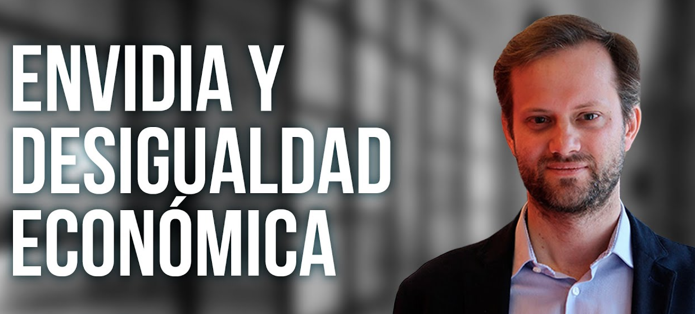
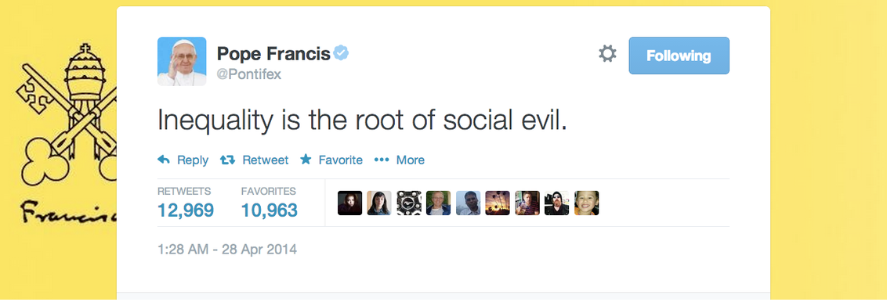
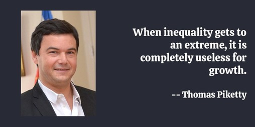
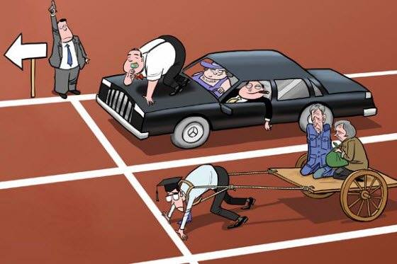
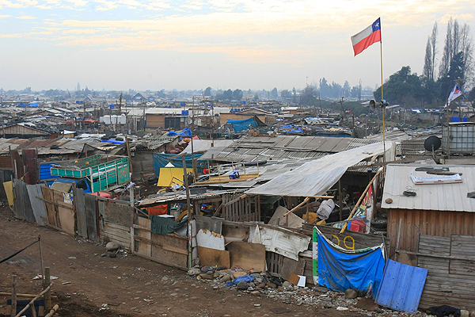
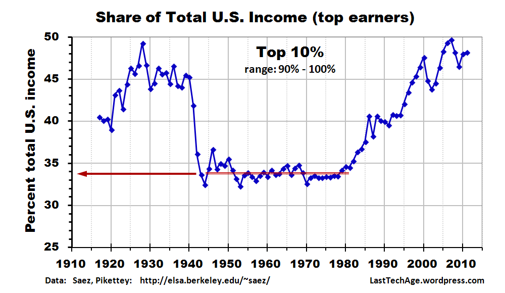
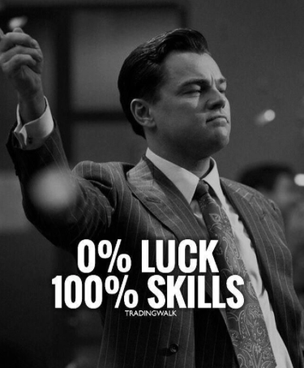
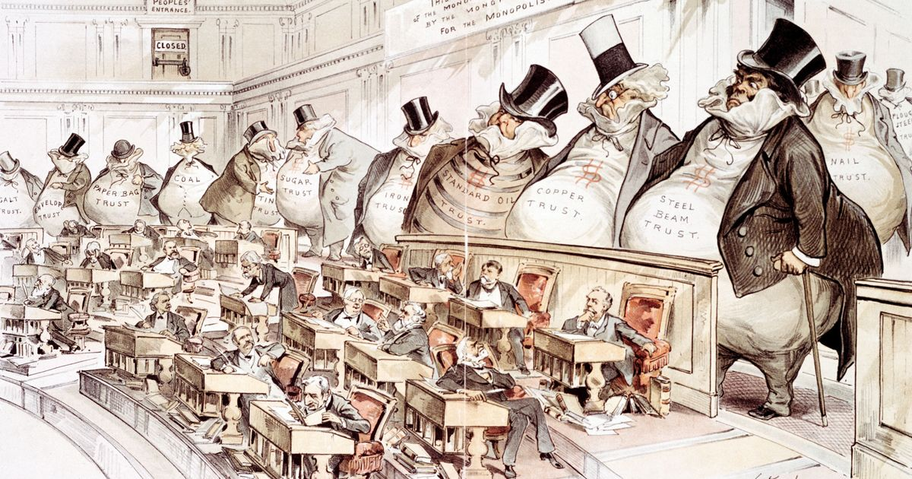
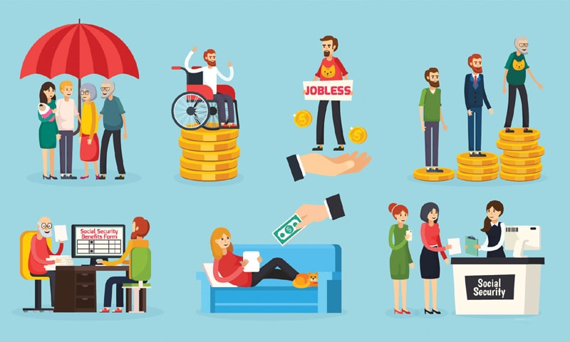

class: inverse, center, middle

# Equipo 

---

## Profesores

--

.bold[Mauricio Bucca]

  - Profesor Asistente, Sociología UC

  - PhD en Sociología, Cornell University, NY
    - PhD Minor en Estadística, Departamento de Estadística, Cornell University

  - Investigación: movilidad social intergeneracional,  desigualdades en el mercado laboral, creencias sobre las desigualdades, métodos cuantitativos
  
  - Métodos: modelación estadística, estrategias empíricas para inferencia causal, métodos experimentales y computacionales

 
--

.bold[Información de contacto]
 - mail: mebucca@uc.cl
 - webpage: https://mebucca.github.io/

---

## Profesores

--

.bold[Luis Maldonado]

  - Profesor Asistente, Sociología UC

  - Doctor in Economics and Social Sciences (Dr.rer.pol), University of Cologne, Germany, 2012

  - Investigación: estado de bienestar, desigualdad económica, pobreza, desastres, métodos cuantitativos-
  
  - Métodos: modelación estadística, estrategias empíricas para inferencia causal, estudios Longitudinales, métodos experimentales

 
--

.bold[Información de contacto]
 - mail: lmaldona@uc.cl
 - webpage: http://www.luismaldonado.org

---

## Ayudante

--
 

.pull-left[
.bold[Matías Gómez]

- Sociólogo UC, Magíster en Sociología UC

- Estudiante de doctorado UC

- Investigación: financiarización de los hogares; plataformas de redes sociales y democracia.

]
.figure-right[

]

---
class: inverse, center, middle

# Desigualdad

---

## La desigualdad es un asunto de toda relevancia

---
## ¿Es la desigualdad un problema? 

.pull-left[

]
.pull-right[

]

---

## La desigualdad es un problema. Un problema complejo.

.pull-left[

]
.pull-right[

]

---
class: inverse, center, middle

# Este curso

---
## Descripción

 

- Este curso examina diversas formas de desigualdad económica y social usando una perspectiva macro social, interdisciplinaria y comparada.

 
--

- El curso se estructura en torno a dos grandes bloques temáticos:

 
--

  - El primero discute conceptos de las ciencias sociales para estudiar y medir desigualdad y revisa las principales tendencias y debates en torno a las mismas.

 
--
  
  - El segundo bloque examina los marcos institucionales desarrollados por las sociedades occidentales contemporáneas para enfrentar la desigualdad y los problemas sociales asociados a ella. 

---
## Objetivos

 
--

-  Conocer los principales conceptos utilizados por la sociología y otras ciencias sociales para estudiar y medir la desigualdad.

 
--

-  Conocer las tendencias y debates nacionales e internacionales acerca de la desigualdad.

 
--

- Conocer los marcos institucionales desarrollados por las sociedades occidentales contemporáneas para enfrentar la desigualdad.

 
--

-  Preparar a los estudiantes para evaluar críticamente los principales conceptos que son usados para estudiar desigualdades. 

---
class: inverse, center, middle

# Contenidos

---
## Contenidos

 - 1) Aspectos normativos: desigualdad de oportunidades y de resultados.

.pull-left[

]
.pull-right[

]

---
## Contenidos

- 2) Pobreza

---
## Contenidos

- 3) Desigualdad económica

---
## Contenidos

- 4) Movilidad social

---
## Contenidos

- 5) Desigualdad y movilidad

---
## Contenidos

- 6) Creencias sobre la desigualdad

---
## Contenidos

- 7) Consecuencias de la desigualdad

---
## Contenidos

- 8) Redistribución y Estado de bienestar.

---
## Contenidos

- 9) Preferencias redistributivas.

---
class: inverse, center, middle

# Aspectos logísticos

---
## Metodologia de trabajo 

 
--

-  Clases:
  - Primer módulo: exposición del profesor.
 - Segundo módulo: presentaciones y discusión de lecturas asignadas 

 
--
-  Atención estudiantes: horario de consulta viernes 10:00-11:00 AM.

 
--
-  Ayudantía: viernes 8:30 AM.

---
## Evaluación 

 
--

-  Dos informes: 20% cada uno.

 

-  Trabajo final: 30%.

 

- Presentación: 15%.

 

- Participación: 15%.

---
## Bibliografía y calendarización

.bold[Semana 01: Aspectos normativos del debate: desigualdad de oportunidades y de resultados (17 de agosto)]

 
Lecturas obligatorias:

 

1. David B. Grusky, Jasmine Hill; Inequality in the 21st Century, a reader; Taylor & Francis 2017; Chapter 1: Poverty and Inequality in the 21st Century, p.1-7.

2. John E. Roemer; Equality of Opportunity; Harvard University Press 1998.  Chapter 1 and Chapter 2.

3. Robert H. Frank; Success and Luck: Good Fortune and the Myth of Meritocracy, Chapter 3: How winner-take-all markets magnify luck's role.

4. Daniel Matamala; Pedro, Juan y Diego; La Tercera 2019.

---
## Material del curso

Todo el material del curso será almacenado y actualizado regularmente en repositorio `Github`:

 
.center[

https://github.com/mebucca/sdd_sol186s
]

---
class: inverse, center, middle

.huge[
**Hasta la próxima clase. Gracias!**
]

 
Mauricio Bucca  
https://mebucca.github.io/

 
Luis Maldonado  
http://www.luismaldonado.org 

