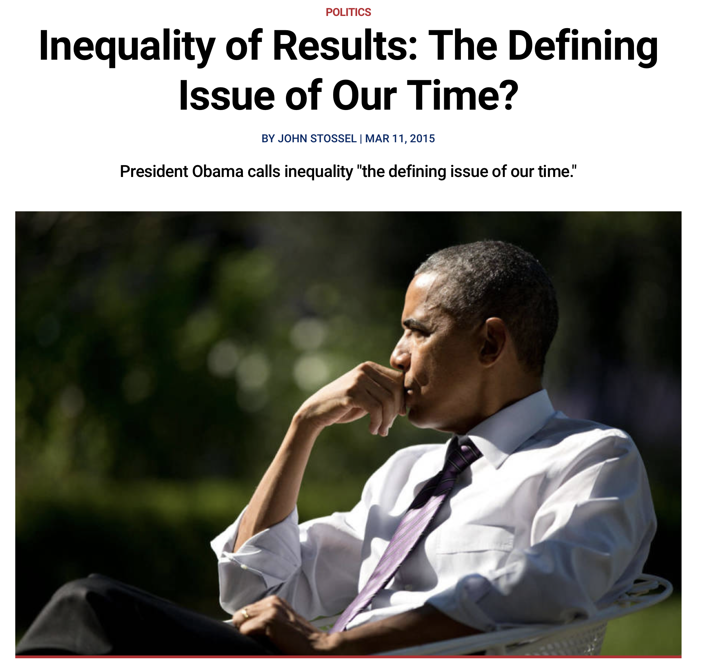
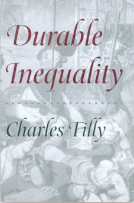
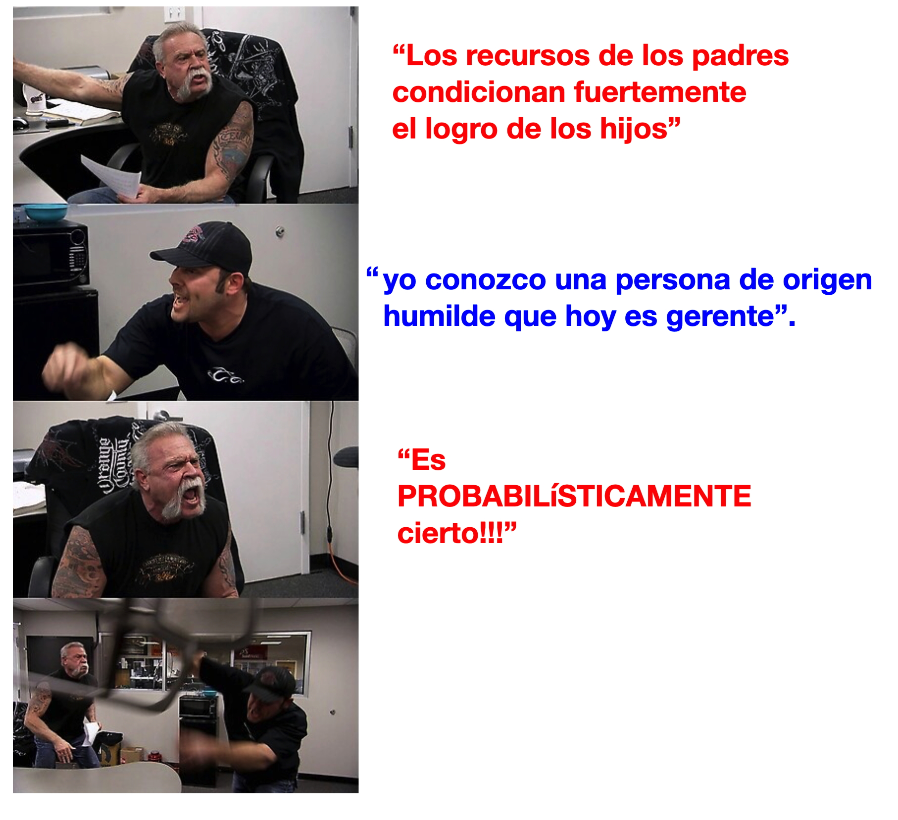
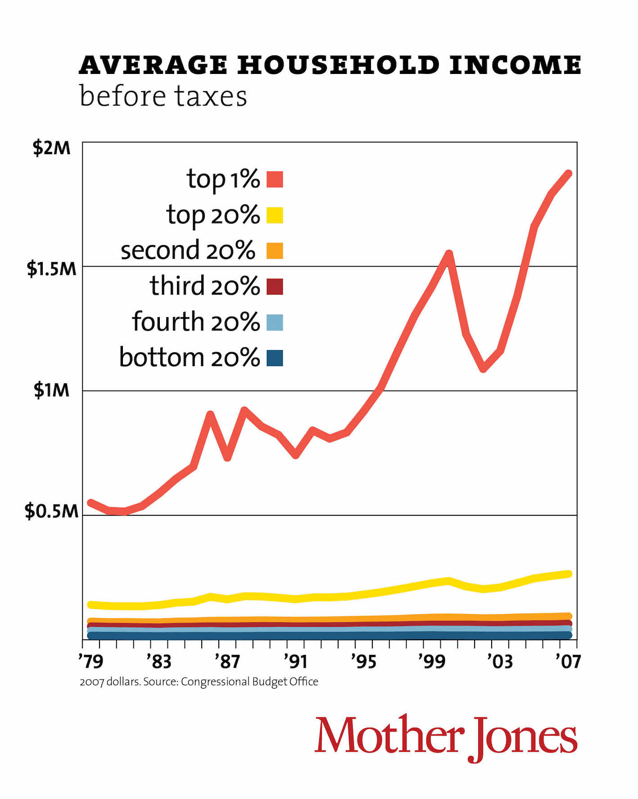

```{r, echo=F, message=F, warning=F,  out.width = '300px'}
library("tidyverse")
library("ineq")

theme_set(theme_bw())
options(digits=3, scipen = 100)
```





---

<br>
<br>

.pull-left[

]

--

.pull-right[

]


---
## ¿Desigualad con respecto a que? 


Típicamente,

- Logro educacional

- Ocupaciones (clases sociales)

- Ingresos

- Riqueza

- Consumo (bienes privados y públicos)

- Capital social (redes)

- Capital cultural

- Prestigio social (status)

- Salud

- etc ...

---
## ¿Desigualad entre quienes? 

<br>

.pull-left[

- Individuos

- Grupos (género, raza, paises, etc.)

]

.pull-right[

]


---
class: inverse, center, middle

# Desigualdad de resultados

---
## Desigualdad de resultados, una definición general 

--

<br>

- $i: \{1,2,3, \dots, n\}$ individuos (u otra unidad)

- $X$ es algún "recurso" (educación, ingresos, felicidad)

--

- Coloquialmente hablando, $X$ se distribuye desigualmente si no todo $x_i$ toma el mismo valor de $X$. Por ejemplo: $x_1 \neq x_2$

--
<br>

¿Qué tipo de desigualdad? 


- Determinística (matemática)   ❌ 

- Probabilística (estadística):   ✅

  - No significa que $x_{i}$ toma cualquier valor con igual probabilidad. Significa que el resultado tiene un grado escencial de aleatoridad.


---
## Desigualdad de resultados, una definición general 



---
## Desigualdad de resultados, una definición general 


Supongamos que $\mathbf{y}: \{y_{1}, y_{2}, y_{3}, \dots, y_{n}\}$ representa los ingresos de $n$ individuos. Consideremos diferentes escenarios:


.bold[Igualdad de resultados]

$$y_{i} = 500 + \epsilon_{i}, \text{ donde }$$
$$\epsilon_{i} \sim \text{Normal}(\mu=0, \sigma = 10)$$
```{r, echo=F, message=F, warning=F,  out.width = '300px'}
N  <- 10000
mu <- rep(500,N)
e  <- rnorm(n=N, mean=0,sd=10)
y <- mu + e

head(data_frame(mu,e,y), n=10)
```

---
## Desigualdad de resultados, una definición general 


.pull-left[
```{r, echo=F, message=F, warning=F,  out.width = '300px'}
head(data_frame(mu,e,y), n=10)
```

]
.pull-right[
```{r, echo=F, message=F, warning=F,  out.width = '300px'}
tibble(y=y) %>% ggplot(aes(x=y)) + geom_density(color="blue")+
  geom_vline(xintercept = mean(y), color="red") + xlim(300,700)

print(c(Promedio=round(mean(y),0), SD=sd(y), Gini=Gini(y), `max-min`= max(y + abs(min(y))) - min(y + abs(min(y)))  ))

```
]

---
## Desigualdad de resultados, una definición general 


.bold[Desigualdad de resultados (baja)]

$$y_{i} = 500 + \epsilon_{i}, \text{ donde }$$
$$\epsilon_{i} \sim \text{Normal}(\mu=0, \sigma = 100)$$

```{r, echo=F, message=F, warning=F,  out.width = '300px'}
N  <- 10000
mu <- rep(500,N)
e  <- rnorm(n=N, mean=0,sd=100)
y <- mu + e

head(data_frame(mu,e,y), n=10)
```

---
## Desigualdad de resultados, una definición general 

.pull-left[
```{r, echo=F, message=F, warning=F,  out.width = '300px'}
head(data_frame(mu,e,y), n=10)
```

]
.pull-right[
```{r, echo=F, message=F, warning=F,  out.width = '300px'}
tibble(y=y) %>% ggplot(aes(x=y)) + geom_density(color="blue")+
  geom_vline(xintercept = mean(y), color="red") + xlim(0,1000)

print(c(Promedio=round(mean(y),0), SD=sd(y), Gini=Gini(y), `max-min`= max(y + abs(min(y))) - min(y + abs(min(y)))  ))

```
]

---
## Desigualdad de resultados, una definición general 


.bold[Desigualdad de resultados (alta)]

$$y_{i} = 500 + \epsilon_{i}, \text{ donde }$$
$$\epsilon_{i} \sim \text{Normal}(\mu=0, \sigma = 500)$$


```{r, echo=F, message=F, warning=F,  out.width = '300px'}
N  <- 10000
mu <- rep(500,N)
e  <- rnorm(n=N, mean=0,sd=500)
y <- mu + e

head(data_frame(mu,e,y), n=10)
```

---
## Desigualdad de resultados, una definición general 


.pull-left[
```{r, echo=F, message=F, warning=F,  out.width = '300px'}
head(data_frame(mu,e,y), n=10)
```

]
.pull-right[
```{r, echo=F, message=F, warning=F,  out.width = '300px'}
tibble(y=y) %>% ggplot(aes(x=y)) + geom_density(color="blue")+
  geom_vline(xintercept = mean(y), color="red") + xlim(-1500,2000)

print(c(Promedio=round(mean(y),0), SD=sd(y), Gini=Gini(y), `max-min`= max(y + abs(min(y))) - min(y + abs(min(y)))  ))

```
]

---
## Desigualdad de resultados, una definición general 

¿Cuánta desigualdad es "demasiada"? ¿Cuanta desigualdad es aceptable?

.pull-left[

]

--

<br>
<br>

.pull-right[
$y_{i} = \mu + \underbrace{\epsilon_{i}}_{\text{¿que es esto?}}$
]

---
class: inverse, center, middle

# Desigualdad de oportunidades

---

## ¿Una cancha desnivelada?

<br>
.pull-left[

]


---

## Resultados y  Oportunidades

--

- En general no existe una diferencia escencial entre resultados y oportunidades. Es un problema de "antes" y "después".


$$\text{resultados}_{i} = f(\text{oportunidades}_{i})$$
- Excepción: atributos adscritos tales como raza, sexo, etc.

<br>
--

Desigualdad de resultados refleja, en parte, desigualdad de oportunidades. Ejemplos:

<br>
--

- resultados: estado de salud, oportunidades: ingresos

--

- resultados: ingresos, oportunidades: logro educacional

--

- resultados: logro educacional, oportunidades: ingresos de los padres


--

- resultados: ingresos de los padres, oportunidades: logro educacional de los padres


- etc.  


---

## Resultados y  Oportunidades

<br>

$$y_{i} = \mu + \underbrace{\epsilon_{i}}_{\text{¿que es esto?}}$$

<br>
--

Las teorías sobre (des)igualdad de oportunidades típicamente idenfican dos tipo de fuentes para desigualad de oportunidades: esfuerzo (agencia) y circunstancias (estructura). Formalmente:

<br>

$$\epsilon_{i} = \color{blue}{\beta  \times \underbrace{E_{i}}_{\text{"esfuerzo": elección autónoma}}} + \color{red}{\theta  \times \underbrace{C_{i}}_{\text{"circunstancias": fuera del control individual}}} + \underbrace{\tau_{i}}_{\text{"suerte" residual}}$$
<br>
--

Luego:


$$y_{i} = \mu + \beta E_{i} + \theta C_{i} +\tau_{i}$$

---

## Resultados y  Oportunidades

Resultado: salud física (de 0 a 10)

  - "Esfuerzo" (agencia): no fumador (E=1) / fumador (E=0)
  
  - "Circunstancias" (estructura): universitario (C=1) / no-universitario (C=0)

Supongamos que la siguiente ecuación describe el estado de salud de una persona:

$$\text{salud}_{i} =  1 + 2 E_{i} + 3 C_{i} +\tau_{i}$$
--

.pull-left[
```{r, echo=F, message=F, warning=F,  out.width = '300px'}

mydata <- tibble(c=rbinom(N,1,0.3), e=rbinom(N,1, (exp(0.4*c))/(1+exp(0.4*c))) )
mydata <- mydata %>% mutate(salud = 1 +  2*e + 3*c + rnorm(N,0,0.5)) %>%
          mutate(e=if_else(e==1,"no-fumador","fumador"), c=if_else(c==1,"univ.","no-univ."))

mydata %>% group_by(c,e) %>% summarise(promedio_salud = mean(salud))
```

]
.pull-right[
```{r, echo=F, message=F, warning=F,  out.width = '300px'}
mydata %>% ggplot(aes(x=salud, group=interaction(e,c), colour=factor(c))) + geom_density()
```
]

---

## Desigualdad de oportunidades

.bold[¿Que tipo de desigualdades son aceptables?]
  
--

  - Aquellas que son atribuibles a factores que los individuos pueden controlar ("esfuerzo", "elección autónoma", "agencia")
  
  - Desigualdades en resultados que provienen de circunstancias desiguales deben ser corregidas por medio de políticas ("igualar la cancha").

<br>
--

.bold[Desafios]


  - ¿Que factores consideramos "esfuerzo" y cuales "circunstancias? -- problema normativo.
  
  - ¿Cuando tenemos una lista suficientemente exaustiva de circunstancias? (comparar peras con peras) -- problema de datos.
  

---
## Desigualdad de oportunidades

Resultado: salarios

  - "Circunstancias" (estructura): hombre (C=1) / mujer(C=0)

  - "Esfuerzo" (agencia, elección autónoma): doctor(a) (E=1) / enfermer@ (E=0)


Supongamos que la siguiente ecuación describe el salario de una persona:

$$\text{salario}_{i} = 100 + 500 E_{i} + 200 C_{i} +\tau_{i}$$
--

.pull-left[
```{r, echo=F, message=F, warning=F,  out.width = '300px'}
set.seed(32323)
mydata <- tibble(c=rbinom(N,1,0.5), e=rbinom(N,1, (exp(0.7*c))/(1+exp(0.7*c))) )
mydata <- mydata %>% mutate(salario = 100 +  500*e + 200*c + rnorm(N,0,200)) %>%
          mutate(e=if_else(e==1,"doctor(a)","enfermer@"), c=if_else(c==1,"hombre","mujer"))

mydata %>% group_by(c) %>% summarise(promedio_salario = mean(salario))
```

]
.pull-right[
```{r, echo=F, message=F, warning=F,  out.width = '300px'}
mydata %>% ggplot(aes(x=salario, group=interaction(e,c), colour=c)) + geom_density()
```
]

---

## Desigualdad de oportunidades

Resultado: salarios

  - "Circunstancias" (estructura): hombre (C=1) / mujer(C=0)

  - "Esfuerzo" (agencia, elección autónoma): doctor(a) (E=1) / enfermer@ (E=0)

Donde el salario de una persona puede ser descrito con la siguiente ecuación:

$$\text{salario}_{i} = 100 + 500 E_{i} + 200 C_{i} +\tau_{i}$$

<br>
--

.bold[Desafío #1: delimitación entre esfuerzo y circunstancias]:

- No cabe duda que ser hombre o mujer es una circunstancia

- ¿es la ocupación una elección  autónoma?
  - parcialmente depende de factores cirncunstanciales (capital cultural, recursos padres, normas de género, etc.)


---

## Desigualdad de oportunidades

Resultado: salarios

  - "Circunstancias" (estructura): hombre (C=1) / mujer(C=0)

  - "Esfuerzo" (agencia, elección autónoma): doctor(a) (E=1) / enfermer@ (E=0)

Donde el salario de una persona puede ser descrito con la siguiente ecuación:

$$\text{salario}_{i} = 100 + 500 E_{i} + 200 C_{i} +\tau_{i}$$

<br>
--

.bold[Desafío #2: donde terminan circunstancias]:

- No cabe duda que ser hombre o mujer es una circunstancia

- ¿cuanto de lo que parece "suerte" residual son en realidad circunstancias no observadas?
  - en nuestro ejemplo consideramos que todas personas del mismo sexo tienen las mismas circunstancias, pero no consideramos lugar de residencia, raza, clase social de origen, etc.


---
## Desigualdad de oportunidades

Supongamos que ahora tenemos el modelo correcto:

<br>

Resultado: salarios

  - "Circunstancias" (estructura): genero , raza, clase social de origen -- C.

  - "Esfuerzo" (agencia, elección autónoma): doctor(a) (E=1) / enfermer@ (E=0), donde 
    
    $E_{i} = 2 C_{i} + \xi$
  
<br>  
--

Por tanto, el salario de una persona puede ser descrito con la siguiente ecuación:


$$\text{salario}_{i} = 100 + 500 E_{i} + 600 C_{i} +\tau_{i}$$
$$\text{salario}_{i} = 100 + 500 (2C_{i} + \xi) + 600 C_{i} +\tau_{i}$$
$$\text{salario}_{i} = 100 + \color{red}{\underbrace{1600C_{i}}_{\text{circunstancias}}} + \color{blue}{\underbrace{500\xi}_{\text{esfuerzo}}}  + \underbrace{\tau_{i}}_{\text{suerte residual}}$$
---
## Desigualdad de oportunidades

Supongamos que el salario de una persona puede ser descrito con la siguiente ecuación:

$$\text{salario}_{i} = 100 + \color{red}{\underbrace{1600C_{i}}_{\text{circunstancias}}} + \color{blue}{\underbrace{500\xi}_{\text{esfuerzo}}}  + \underbrace{\tau_{i}}_{\text{suerte residual}}$$
<br>
--

Política de igualación de oportunidades: eliminar parte de desigualdad de resultados que proviene de desigualdad en circunstancias. 

- En nuetro ejemplo, si una política lograra que el genero, raza y clase social de origen no influyeran en el salarion de una persona entonces

$$\text{desigualdad de salario}: \color{blue}{\underbrace{500\xi}_{\text{esfuerzo}}}  \text{   ,   }  \underbrace{\tau_{i}}_{\text{suerte residual}}$$
--
Posibles políticas:

1) Igualar circunstancias

2) Eliminar efecto de circunstancias desiguales

---

## Desigualdad de oportunidades

Resultado: salarios

  - "Circunstancias" (estructura): hombre (C=1) / mujer(C=0)

  - "Esfuerzo" (agencia, elección autónoma): doctor(a) (E=1) / enfermer@ (E=0)
  

Supongamos que la siguiente ecuación describe el salario de una persona:

$$\text{salario}_{i} = 100 + 500 E_{i} + 0 C_{i} +\tau_{i}$$
--

.pull-left[
```{r, echo=F, message=F, warning=F,  out.width = '300px'}
set.seed(32323)

mydata <- tibble(c=rbinom(N,1,0.5), e=rbinom(N,1,0.58) )
mydata <- mydata %>% mutate(salario = 100 +  500*e + rnorm(N,0,200)) %>%
          mutate(e=if_else(e==1,"doctor(a)","enfermer@"), c=if_else(c==1,"hombre","mujer"))

mydata %>% group_by(e) %>% summarise(promedio_salario = mean(salario))
```

]
.pull-right[
```{r, echo=F, message=F, warning=F,  out.width = '300px'}
mydata %>% ggplot(aes(x=salario, group=interaction(e,c), colour=c)) + geom_density()
```
]

---

## El rol del la suerte

--
.pull-left[
```{r, echo=F, message=F, warning=F,  out.width = '300px'}
set.seed(32323)

mydata <- tibble(c=rbinom(N,1,0.5), e=rbinom(N,1,0.58) )
mydata <- mydata %>% mutate(salario = 100 +  500*e + rnorm(N,0,200)) %>%
          mutate(e=if_else(e==1,"doctor(a)","enfermer@"), c=if_else(c==1,"hombre","mujer"))

mydata %>% filter(e=="doctor(a)", c=="hombre") %>% head(n=10)
```

]
.pull-right[
```{r, echo=F, message=F, warning=F,  out.width = '300px'}
mydata %>% filter(e=="doctor(a)", c=="hombre") %>% ggplot(aes(x=salario, colour=c)) + geom_density()
```
]

- Que explica las diferencias de salario entre personas con las mismas "circunstancias" y mismo nivel de "esfuerzo"?

- Suerte. Que es? la aleatoriedad de la vida? circunstancias no observadas (e.j. talento)?

- Debemos corregir estas desigualdades? Cuanta desigualdad de este tipo podemos tolerar?


---
## Para discutir ...

<br>


---
## Lecturas

<br>
Lecturas obligatorias:

<br>

1. David B. Grusky, Jasmine Hill; Inequality in the 21st Century, a reader; Taylor & Francis 2017; Chapter 1: Poverty and Inequality in the 21st Century, p.1-7.

2. John E. Roemer; Equality of Opportunity; Harvard University Press 1998.  Chapter 1 and Chapter 2.

3. Robert H. Frank; Success and Luck: Good Fortune and the Myth of Meritocracy, Chapter 3: How winner-take-all markets magnify luck's role.

4. Daniel Matamala; Pedro, Juan y Diego; La Tercera 2019.

---
## Lecturas

<br>
Lecturas complementarias:

<br>

1. Christopher Jencks; Inequality. A Reassessment of the Effect of Family and Schooling in America; Basic Books, Inc., Publishers 1971. Chapter 1: From Equal Opportunity to Equal Results, p.3-15.

2. Florencia Torche; Privatization Reform and Inequality of Educational Opportunity: The Case of Chile; Sociology of Education; 2005.

3. Javier Nunez, Andrea Tartakowsky; The relationship between income inequality and inequality of opportunities in a high-inequality country: the case of Chile; Applied Economics Letters; 2011.


---
## Material del curso

Todo el material del curso será almacenado y actualizado regularmente en repositorio `Github`:

<br>
.center[


https://github.com/mebucca/sdd_sol186s
]


---
class: inverse, center, middle

.huge[
**Hasta la próxima clase. Gracias!**
]

<br>
Mauricio Bucca <br>
https://mebucca.github.io/


