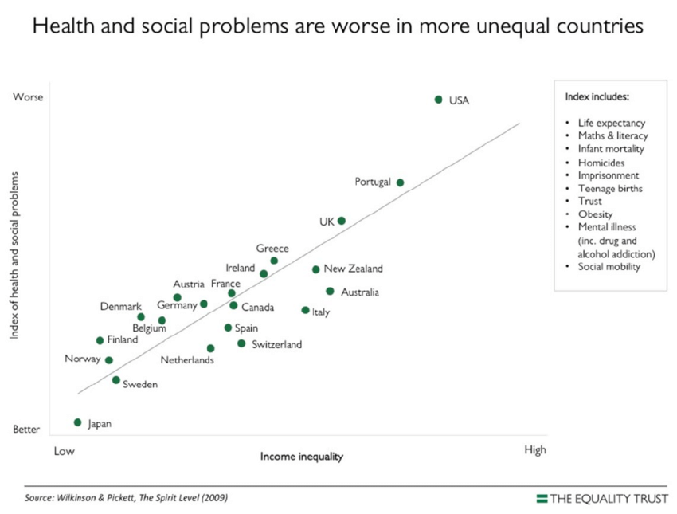

class: middle
## ¿Importa la desigualad?

--

.center[]

---
class: middle
## ¿Importa la desigualad?

.pull-left[]
.pull-right[]

---
## Consequencias de la desigualdad

- Desigualdad oportunidades

- Expectativas de vida

- Salud 

- Felicidad

- Crimen 

- Influencia politica

- ...

- ...

- ...

- Cohesión social

---
## The Spirit Level (Wilkinson & Pickett)

.center[]

---
## Consequencias de la desigualdad

 

- Perspectiva de los recursos: 

  - Distribución desigual de recursos individuales

  - Distribución desigual de infraestructural y servicios

 
--

- Consequencias sociales y psicológicas de la desigualdad

  - Consequencias psicológicas: malestar, deprivación relativa, stress, desapego, etc.

  - Consequencias sociales: homofilia, falta inter-contacto,desapegro de vida social, comportamiento anti-social.

---
## Material del curso

Todo el material del curso será almacenado y actualizado regularmente en repositorio `Github`:

 
.center[

https://github.com/mebucca/sdd_sol186s
]

---
class: inverse, center, middle

.huge[
**Hasta la próxima clase. Gracias!**
]

 
Mauricio Bucca  
https://mebucca.github.io/

