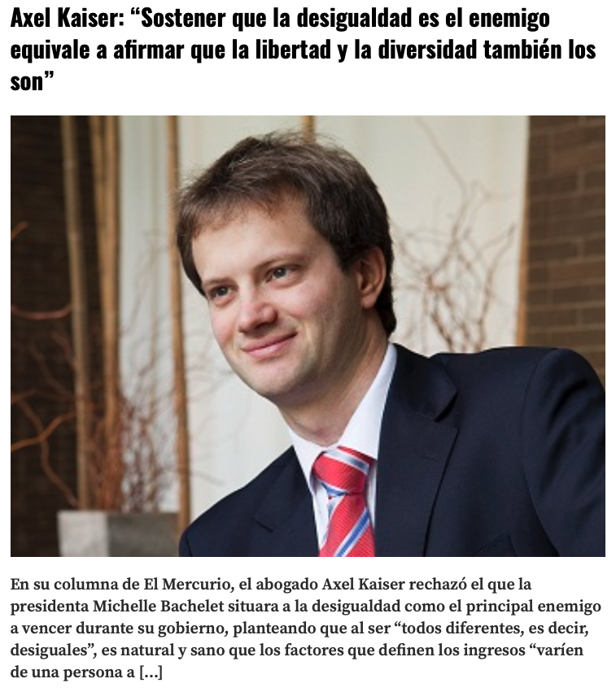

class: middle
## ¿Importa la desigualad?

--

.center[]

---
class: middle
## ¿Importa la desigualad?

.pull-left[]
.pull-right[]

---
## Consequencias de la desigualdad

- desigualdad oportunidades educacionales
- expectativas de vida
- felicidad
- crimen 
- influencia politica

---
## Consequencias de la desigualdad

- resource theory: 
  - unequal distribution of individual resources
  - unequal distribution of infrastructure and facilities

- social and psychological consequences of inequality
  - psychological consequences:negative feeling, relative deprivation, etc. stress, desapego, etc.
  - social consequences: homofilia, inter-contacto, etc --> sensaci'on de falta de poder y desapegro de vida social.

- civic engagement y pro-social behavior 

---
## Material del curso

Todo el material del curso será almacenado y actualizado regularmente en repositorio `Github`:

 
.center[

https://github.com/mebucca/sdd_sol186s
]

---
class: inverse, center, middle

.huge[
**Hasta la próxima clase. Gracias!**
]

 
Mauricio Bucca  
https://mebucca.github.io/

