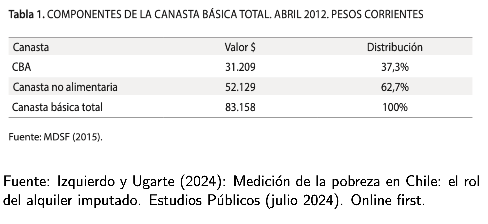
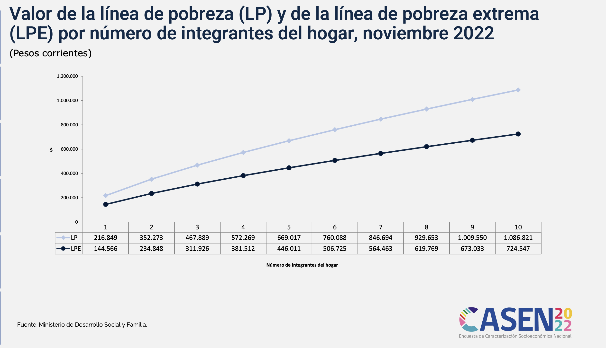
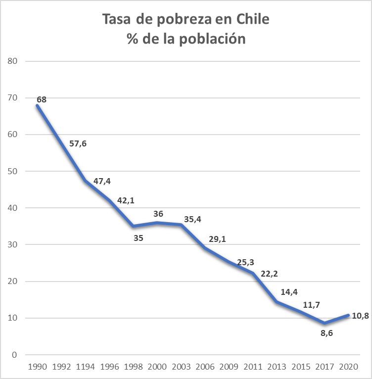
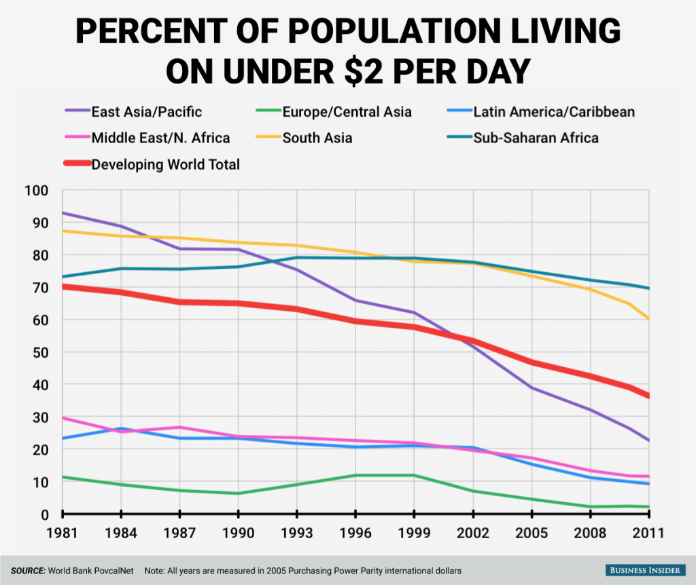
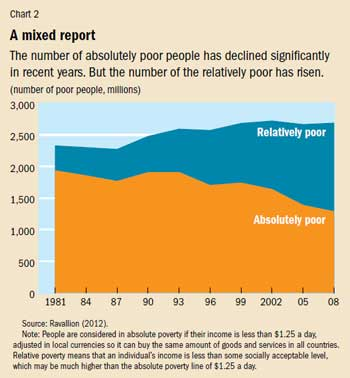

```{r xaringan-themer, include=FALSE, warning=FALSE}
library(tidyverse)
library(xaringanthemer)
primary_color = "#AAA93E"  # Deep teal - professional yet distinctive
secondary_color = "#331234"  # Warm orange for contrast and highlights
background_color = "#F7F8F9"  # Light off-white for better readability
header_font = google_font("Archivo")
text_font = google_font("Inconsolata")
link_color = "#911540"  # Lighter teal for links
style_duo_accent(primary_color = primary_color, 
                 secondary_color = secondary_color,
                 background_color = background_color,
                 header_font_google = header_font,
                 text_font_google = text_font, 
                 link_color = link_color
)
```

class: inverse, center, middle


# Conceptos de pobreza  

---
## Mínimos Sociales de Bienestar

--
<br>

.bold[Pregunta Central:] ¿Cuál es el estándar de vida aceptable?


<br>
--


Los recursos no tienen valor intrínseco, sino instrumental (ejemplo: el dinero no se come, pero permite comprar alimentos). Dos enfoques principales:


1. **Conceptualizaciones directas:**
   - Centradas en bienes o actividades con valor intrínseco
   - Miden directamente calidad de vida y satisfacción de necesidades básicas
   - Enfoque en capacidades y funcionamientos

2. **Conceptualizaciones indirectas:**
   - Enfocadas en recursos como medios para el bienestar
   - Miden ingresos, riqueza, transferencias y acceso a bienes materiales
   - Base para políticas redistributivas


---
## Pobreza como substistencia

<br>

- Un individuo es pobre si no tiene los recursos necesarios para un nivel mínimo de consumo.

<br>
--

- **Rowntree (citado en Ringen, 1988)**: pobreza es cuando "los ingresos totales son insuficientes para obtener lo mínimo necesario para la eficacia física"  (reproducción de condiciones materiales de existencia).

<br>
--

.bold[Consideraciones:]

- ¿Qué se considera necesidad mínima?  (rol de expertos)

- Foco en recursos


---
## Pobreza como privación  

<br>
- "Un individuo es pobre si su nivel de consumo está muy por debajo de lo que se considera decente en su sociedad, excluyéndolos de la vida ordinaria" (Ringen, 1988).  

<br>
--

- **Beduek (2018)**: "La privación material se define como la falta impuesta de alimentos, ropa, calefacción y ciertos bienes duraderos y actividades sociales. Se asume que estos bienes y servicios son condiciones clave para la participación social (Guio et al., 2016) o pueden considerarse necesidades para desempeñar los roles sociales esperados (Townsend, 1979)".  


<br>
--

.bold[Consideraciones:]

- ¿Qué se considera como un nivel de consumo aceptable?  (rol de expertos)

- Foco en cómo las personas viven _de facto_.

---
class: inverse, center, middle


# Pobreza Absoluta  


---
## Pobreza Absoluta 


<br>

.bold[Conceptualmente:]


- Establece un piso mínimo de .bold[recursos]: define la pobreza en función de un umbral fijo de recursos mínimos (ingresos).  

- Insuficiencia de recursos necesarios para acceder a bienes y servicios esenciales como alimentación, vivienda y salud.  


<br>
--

.bold[Medición:]

-  Se establecen líneas de pobreza basadas en el costo de una canasta de bienes esenciales. 

- Se considera pobre a quien no alcanza el umbral definido de recursos o consumo.  


---
## Pobreza Absoluta 

### Linea de pobreza

La **línea de pobreza** es un umbral de ingreso o consumo por debajo del cual se considera que una persona o un hogar está en situación de pobreza. Se puede definir como:

$$
Z = \text{umbral de pobreza}
$$

<br>

--
### Situación de pobreza

Sea $y_i$ el ingreso de la persona $i$, entonces una persona se considera pobre si:

$$
y_i < Z
$$

Donde $Z$ es la línea de pobreza.

---
## Pobreza Absoluta 


<br>

###Tasa de pobreza: ¿Que proporción de la población vive en pobreza?

La tasa de pobreza (o incidencia de la pobreza) se define como:

--

$$
H = \frac{P}{N} = \frac{1}{N} \sum_{i=1}^{N} I(y_i < Z)
$$


donde. 

- $N$ es total de individuos en la población.

- $I(y_i < Z)$ es una función indicadora que toma el valor 1 si $y_i < Z$ y 0 en caso contrario.


---
## Pobreza Absoluta 


<br>

### Brecha de pobreza (poverty gap): ¿cuán pobres son los pobres?

La brecha de pobreza mide la distancia promedio de los ingresos de los pobres respecto a la línea de pobreza:

--

$$
PG = \frac{1}{N} \sum_{i=1}^{N} I(y_i < Z) \cdot \frac{Z - y_i}{Z}
$$

--
Esta medida captura la profundidad de la pobreza, reflejando cuánto tendrían que incrementarse los ingresos para que las personas pobres alcancen la línea de pobreza.

---
## Pobreza Absoluta 

<br>

### Pobreza a nivel de hogar y economías de escala

La medición de pobreza a nivel de hogar debe considerar que los recursos se comparten y existen economías de escala. A nivel de hogar se habla de "ingreso equivalente", donde el ingreso equivalente per cápita en el hogar $h$ se define como:

--
$$
y_h^e = \frac{y_h}{n_h^\theta}
$$
- $y_h$ = ingreso total del hogar

- $n_h$ = número de miembros del hogar

- $\theta$ = parámetro de economías de escala (0 ≤ $\theta$ ≤ 1)

--
<br>

- Si $\theta = 0$: Economías de escala perfectas (cada miembro adicional no incrementa los costos). Si $\theta = 1$: Ausencia de economías de escala (el costo aumenta proporcionalmente al número de miembros)


---
## Pobreza Absoluta 

<br>

### Pobreza a nivel de hogar y economías de escala


Por tanto, un hogar se considera en situación de pobreza si su "ingreso equivalente" está por debajo de la linea de pobreza:

--

$$
\frac{y_h}{n_h^\theta} < Z
$$

Es decir,

$$
y_h < Z \cdot n_h^\theta
$$


---
## Pobreza Absoluta: Ilustración

.center[
```{r, echo=F, message=F, warning=F,  out.width = '500px'}

# Gráfico estático de distribución de ingresos y pobreza con valores fijos
# Sin interfaz Shiny, solo visualización directa

library(ggplot2)
library(scales)
library(dplyr)

# Valores fijos para los parámetros
ingreso_medio <- 600000   # Ingreso medio mensual circa 2022
sd <- 650000              # Desviación estándar circa 2022
linea_pobreza <- 185000   # Línea de pobreza por persona circa 2022

# Color personalizado
primary_color <- "#331234"

# Tema personalizado para el gráfico
theme_statplot <- function(base_size = 14, 
                           base_family = "",
                           primary_color = "#331234",
                           bar_alpha = 0.8) {
  
  theme_minimal(base_size = base_size, base_family = base_family) + 
    theme(
      panel.background = element_rect(color = "black", fill = NA, size = 1),
      panel.grid.major = element_line(color = "grey90", size = 0.2),
      panel.grid.minor = element_line(color = "grey95", size = 0.1),
      
      axis.line = element_line(color = "black", size = 0.5),
      axis.ticks = element_line(color = "black", size = 0.5),
      axis.title = element_text(face = "bold", size = rel(1.1)),
      axis.text = element_text(color = "black", size = rel(0.9)),
      
      legend.background = element_rect(fill = NA, color = NA),
      legend.key = element_rect(fill = NA, color = NA),
      legend.title = element_text(face = "bold"),
      
      plot.title = element_text(face = "bold", size = rel(1.3), hjust = 0),
      plot.subtitle = element_text(size = rel(1.1), hjust = 0),
      plot.caption = element_text(size = rel(0.8), hjust = 1),
      
      plot.margin = margin(10, 10, 10, 10)
    )
}

# Funciones auxiliares para los cálculos
calcular_sigma_desde_sd <- function(ingreso_medio, sd) {
  # Relación entre CV (coeficiente de variación) y sigma
  cv <- sd / ingreso_medio
  sigma <- sqrt(log(1 + cv^2))
  return(sigma)
}

calcular_mu_desde_media <- function(ingreso_medio, sigma) {
  mu <- log(ingreso_medio) - sigma^2/2
  return(mu)
}

sigma_a_gini <- function(sigma) {
  gini <- 2 * pnorm(sigma/sqrt(2)) - 1
  return(gini)
}

calcular_pobreza_logn <- function(mu, sigma, linea_pobreza) {
  # Calcular la tasa de pobreza (proporción bajo la línea de pobreza)
  pobreza <- plnorm(linea_pobreza, meanlog = mu, sdlog = sigma)
  return(pobreza)
}

# Calcular parámetros de distribución log-normal
sigma <- calcular_sigma_desde_sd(ingreso_medio, sd)
mu <- calcular_mu_desde_media(ingreso_medio, sigma)
gini <- sigma_a_gini(sigma)

# Generar datos para la distribución log-normal
max_ingreso <- ingreso_medio * 3
x <- seq(0, max_ingreso, length.out = 1000)

# Densidad
density <- dlnorm(x, meanlog = mu, sdlog = sigma)

# Calcular pobreza
pobreza <- calcular_pobreza_logn(mu, sigma, linea_pobreza)

# Combinar datos
df <- data.frame(
  ingreso = x,
  densidad = density
)

# Crear el gráfico
p <- ggplot(df, aes(x = ingreso, y = densidad)) +
  geom_line(size = 1.2, color = primary_color) +
  geom_vline(xintercept = linea_pobreza, linetype = "dashed", color = "red", size = 1) +
  annotate("text", x = linea_pobreza * 1.1, y = max(density) * 0.9, 
           label = "Línea de Pobreza", color = "red", hjust = 0, fontface = "bold", size = 4) +
  geom_area(data = subset(df, ingreso <= linea_pobreza),
            aes(x = ingreso, y = densidad), fill = primary_color, alpha = 0.5) +
  annotate("text", x = linea_pobreza * 0.5, 
           y = max(density[x <= linea_pobreza]) * 1.2, 
           label = paste0("Pobreza: ", round(pobreza*100, 1), "%"), 
           color = primary_color, fontface = "bold", size = 4) +
  scale_x_continuous(labels = scales::label_number(big.mark = ".", decimal.mark = ",")) +
  labs(
    title = "Distribución del Ingreso y Pobreza",
    subtitle = paste0("Media: $", format(ingreso_medio, big.mark = "."), 
                    " | SD: $", format(sd, big.mark = "."), 
                    " | Gini: ", round(gini, 2)),
    x = "Ingreso Mensual (CLP)",
    y = "Densidad",
    caption = paste0("Línea de Pobreza: CLP ", format(linea_pobreza, big.mark = "."))
  ) +
  theme_statplot(base_size = 14) +
  # Añadir línea vertical para la media
  geom_vline(xintercept = ingreso_medio, 
             color = primary_color, linetype = "dotted", size = 0.8) +
  annotate("text", x = ingreso_medio * 1.05, y = max(density) * 0.7, 
           label = "Ingreso Medio", color = primary_color, hjust = 0, size = 3.5)

# Determinar límites adecuados para el eje x
xmax <- min(max_ingreso, ingreso_medio * 2.5)
xmin <- max(0, linea_pobreza * 0.2)

# Aplicar los límites
p <- p + coord_cartesian(xlim = c(xmin, xmax))

# Para mostrar el gráfico
print(p)

# Para guardar el gráfico (descomenta la línea siguiente)
# ggsave("distribucion_ingreso_pobreza.png", p, width = 10, height = 7, dpi = 300)

```
]

---
## Factores de variabilidad en la tasa de pobreza absoluta.  

<br>

- **Triángulo pobreza-crecimiento-desigualdad (Bourguignon, 2004)**:  

  *Cambio en pobreza = F(cambio en ingreso promedio, cambio en distribución del ingreso)*.  


<br>

.center[
[`[DESCOMPOSICIÓN DATT-RAVALLION]`](https://mebucca810.shinyapps.io/class_2/)
]

--


---
## Pobreza Absoluta

<br>

- **Enfoque aplicado**: Utilizado en organismos internacionales para comparaciones entre países y a lo largo del tiempo dentro de un mismo país.  

- **Limitaciones**: No capta variaciones en el bienestar relativo ni cambios en las expectativas sociales sobre necesidades básicas.  


---
## Medición de la pobreza absoluta en Chile

<br>
.bold[Canasta Básica de Alimenos:]

.center[

]

---
## Medición de la pobreza absoluta en Chile

<br>
.bold[Lineas de Pobreza:]

.center[

]


---
## Medición de la pobreza absoluta en Chile

<br>
.bold[Tendencias:]

.center[

]

---
## Pobreza absoluta en el Mundo

<br>
.bold[Lineas de Pobreza:]

.center[

]

---
class: inverse, center, middle

# Pobreza Relativa  

---
## La pobreza relativa como forma de exclusión 

<br>
--

- La pobreza relativa mide fundamentalmente exclusión social

- Establece un piso mínimo de .bold[oportunidades]: permite que cada persona tenga los recursos mínimos para desarrollar su potencial.


- La pobreza relativa implica estar excluido de la vida cotidiana normal. En su forma más extrema, es la incapacidad de acceder a lo necesario para una vida digna.

<br>
--

.bold[Ejemplos de exclusión:]

- Falta de acceso a internet para buscar empleo o acceder a servicios públicos.

- No disponer de la vestimenta adecuada para conseguir un trabajo.

- Dificultades para pagar la educación.

- Acceso limitado a una vivienda digna (las enfermedades respiratorias son un síntoma común de viviendas inadecuadas).


---
## La pobreza relativa como forma de exclusión 

<br>

.bold[Medición:]

- Se mide generalmente como el porcentaje de la población con ingresos por debajo del 50% o 60% de la mediana de ingresos del país.

- Se considera el acceso a bienes y servicios básicos en relación con la sociedad en general.

- La Unión Europea utiliza el umbral del 60% de la mediana de ingresos.

- Países como el Reino Unido, Francia, Alemania y Canadá emplean medidas de pobreza relativa para evaluar el bienestar social.

- La pobreza relativa no es "erradicable". El objetivo es orientar políticas públicas para mejorar la inclusión social.

---
## La pobreza relativa como forma de exclusión 

<br>
.bold[Pobreza relariva en el mundo:]

.center[

]

---
class: inverse, center, middle


##Hasta la próxima clase!

<br>
Mauricio Bucca <br>
https://mebucca.github.io/
