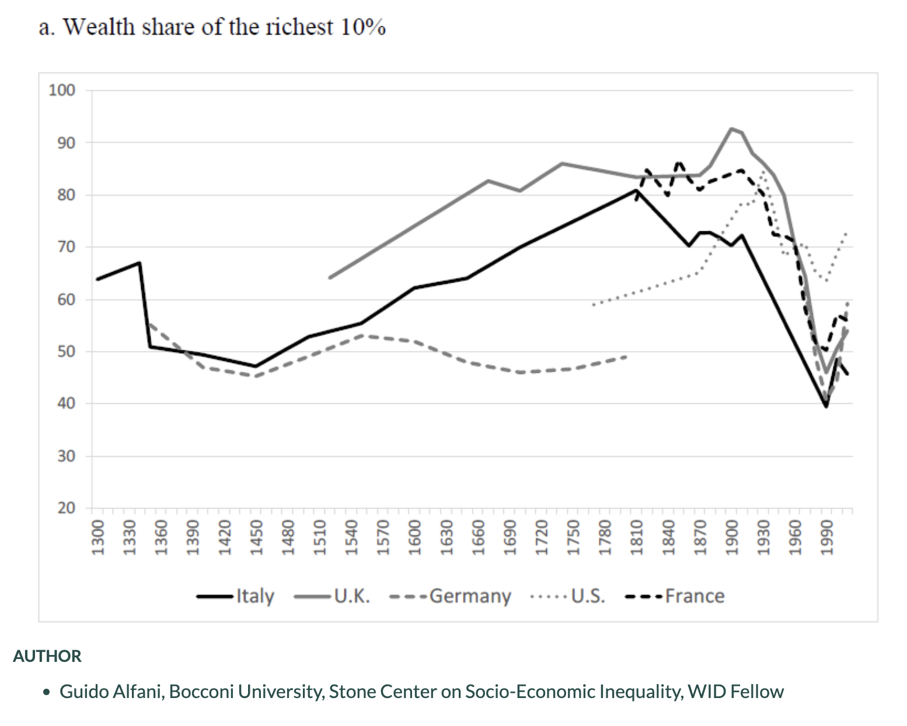
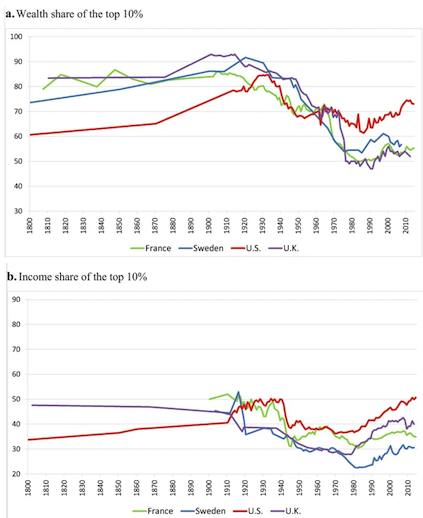
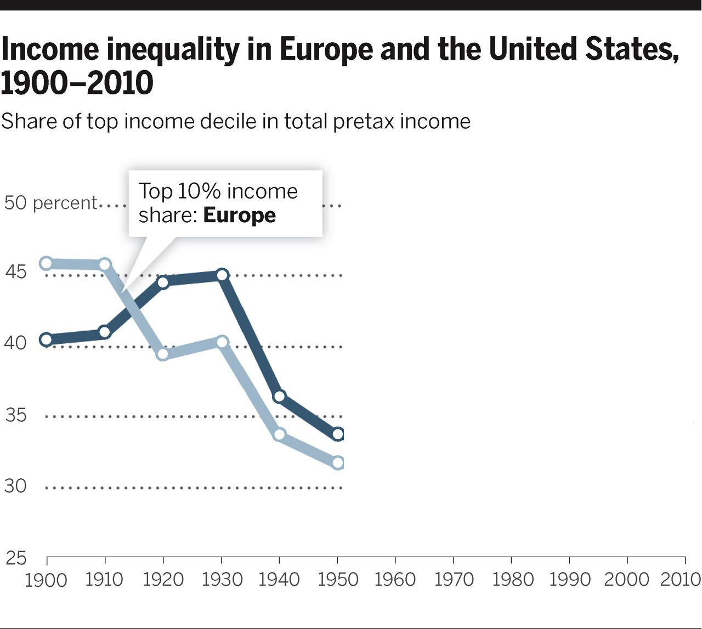
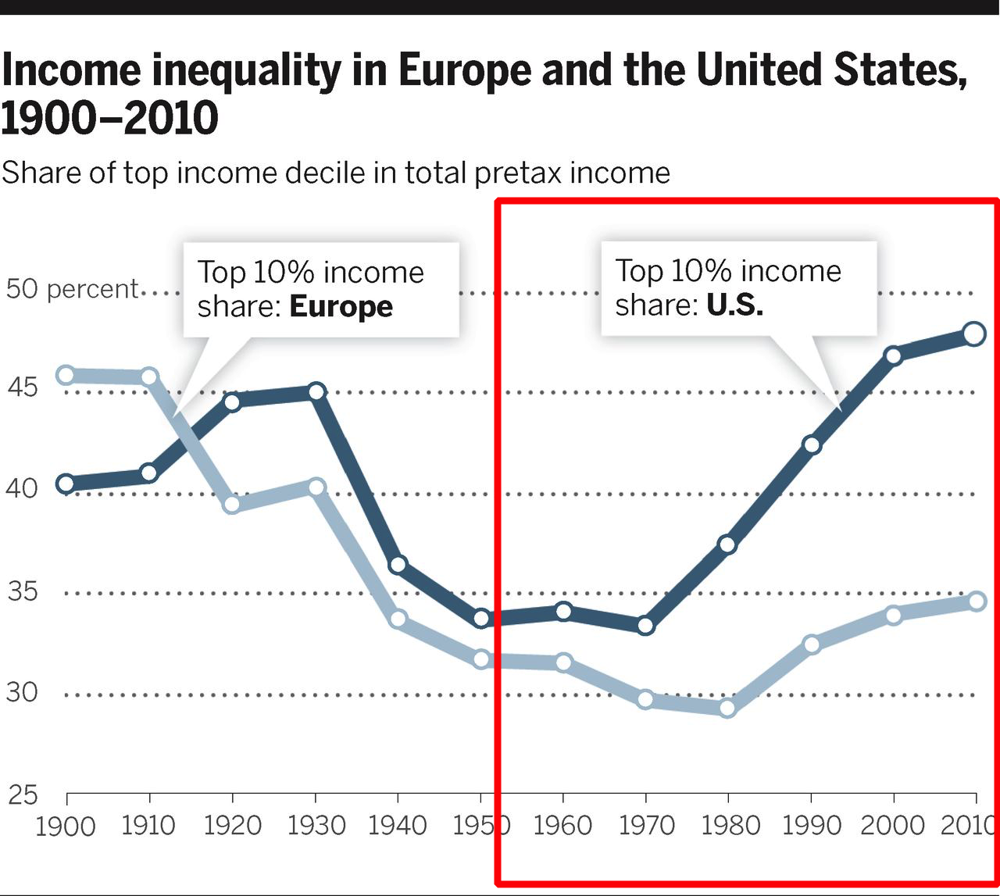
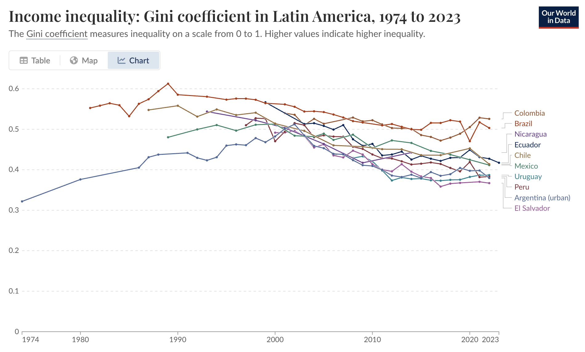

```{r xaringan-themer, include=FALSE, warning=FALSE}
library(tidyverse)
library(xaringanthemer)
primary_color = "#9D7352"    # Weathered terracotta (muted orange-brown)
secondary_color = "#5A7F9C"  # Pond reflection blue (softened and desaturated)
background_color = "#F8F4ED" # Canvas cream (slightly cooler off-white)
link_color = "#6F9B6F"       # Willow green (ashy natural accent)

header_font = google_font("Archivo")
text_font = google_font("Inconsolata")

style_duo_accent(primary_color=primary_color, 
                 secondary_color=secondary_color,
                 background_color=background_color,
                 header_font_google=header_font,
                 text_font_google=text_font, 
                 link_color=link_color)

options(digits=3, scipen = 100)

```

class: inverse, center, middle

# Tendecias

---
## Desigualdad en el (muy) largo plazo


.pull-left[

]

--

.pull-right[

- La desigualdad de y riqueza ha aumentado de forma sostenida durante los últimos 700 años, con dos excepciones: tras la Peste Negra (1347–1352) y entre la Primera Guerra Mundial y mediados de los años 70.

- Las tendencias en desigualdad están profundamente moldeadas por las instituciones y las decisiones humanas que las crean y transforman a lo largo del tiempo.

]


---
## Desigualdad en el largo plazo

.pull-left[

]

.pull-right[

<br>

- Durante el siglo XIX, la concentración de riqueza alcanzó niveles históricos, con el 10% más rico poseyendo hasta el 85% en Francia y más del 90% en el Reino Unido hacia 1913.

- Las guerras mundiales redujeron drásticamente la desigualdad en Europa y Norteamérica, afectando especialmente a los patrimonios más grandes.

- Desde los años 80, la desigualdad volvió a crecer, especialmente entrelos países anglosajones.
]

---
class: inverse, center, middle

# Debates


---
## La curva de Kutzner y la evolución de la desigualdad


.pull-left[

<br>


]

.pull-right[

La desigualdad económica seguiría una curva en U invertida en función del ingreso per cápita. A medida que un país se desarrolla:

1. **Etapa temprana del crecimiento**:  
   - El **ingreso per cápita aumenta**, pero también lo hace la **desigualdad**.  
   - Razones: migración rural-urbana, concentración de capital, poca cobertura estatal.

2. **Etapa avanzada**:  
   - El **ingreso per cápita sigue creciendo**, pero la **desigualdad disminuye**.  
   - Razones: impuestos progresivos, educación, derechos laborales, Estado de bienestar.
]

---
## La curva de Kutzner y la evolución de la desigualdad


.pull-left[

]

.pull-right[

La desigualdad económica seguiría una curva en U invertida en función del ingreso per cápita. A medida que un país se desarrolla:

1. **Etapa temprana del crecimiento**:  
   - El **ingreso per cápita aumenta**, pero también lo hace la **desigualdad**.  
   - Razones: migración rural-urbana, concentración de capital, poca cobertura estatal.

2. **Etapa avanzada**:  
   - El **ingreso per cápita sigue creciendo**, pero la **desigualdad disminuye**.  
   - Razones: impuestos progresivos, educación, derechos laborales, Estado de bienestar.
]

---
## La curva de Kutzner y la evolución de la desigualdad (¿?)


.pull-left[

]

.pull-right[

¿Cómo explicamos el aumento de la desigualdad post 70s?


]


---
## Skill-Biased Technological Change (SBTC)

.pull-left[
<br>


]

--

.pull-right[
- .bold[Avances tecnológicos] (computadoras, IA, automatización) aumentan demanda de trabajadores altamente cualificados y disminuyen demanda de trabajadores menos cualificados.

- La tecnología complementa y hace _más productivos_ trabajadores con educación superior y habilidades técnicas, mientras sustituye trabajos rutinarios y menos cualificados.

- Correlación entre adopción de tecnologías digitales y aumento de salarios para trabajadores educados. Ha contribuido a la creciente desigualdad salarial en economías avanzadas desde los 70/80s.

- Mercado laboral polarizado: crecimiento en trabajos muy cualificados (bien pagados) y poco cualificados (mal pagados), con disminución de empleos de cualificación media.
]

---
## $r > g$:  Crecimiento del Capital y Desigualdad (Piketty)


.pull-left[

]

.pull-right[

- Cuando el rendimiento del capital (r) supera el crecimiento económico (g), la desigualdad aumenta inevitablemente

- **Evidencia histórica:**

  - Siglo XIX: Alta concentración de riqueza por reinversión continua del capital
  
  - 1945-1975: Período excepcional de reducción de desigualdad (altos impuestos, gasto social)
  
  - 1980-Presente: Retorno a la concentración por recortes fiscales y desregulación
  
<br>

- La concentración de riqueza es el estado natural del capitalismo sin intervención

- .bold[Propuesta]: Impuestos progresivos sobre el capital para contrarrestar este fenómeno

]

---
## Extracción de Rentas como motor de desigualdad

.bold[Tesis]: La creciente desigualdad refleja principalmente el poder para extraer _rentas_, no diferencias reales de productividad.

- .bold[¿Qué son las rentas económicas?]:  ganancias por encima del nivel competitivo de mercado.

--

.pull-left[

.bold[Mecanismos contemporáneos de extracción de rentas]:

  - Compensación ejecutiva desproporcionada: Salarios de CEOs creciendo 940% desde 1978 vs. 12% para trabajadores promedio.
  
  - Barreras ocupacionales: Licencias profesionales excesivas que limitan entrada a profesiones lucrativas
  
  - Financiarización: Sector financiero capturando valor sin crear productividad proporcional
  
  - Concentración corporativa: Oligopolios que elevan precios y reducen salarios


]

.pull-right[


]

---
##La Desigualdad como decisión social y política

- La desigualdad no es inevitable: es el resultado de decisiones colectivas.

- Países con niveles similares de desarrollo económico muestran desigualdades muy distintas. 

- Mismos avances tecnológicos generan distintos resultados.

- Las políticas públicas moldean las tendencias de desigualdad: impuestos, leyes laborales y regimenes de bienestar.

--

.pull-left[
- .bold[El papel de las instituciones]:

  - Sistemas tributarios (progresivos vs. regresivos)  

  - Regulación de los mercados laborales y financieros  

  - Políticas de bienestar y protección social

]

.pull-right[


]

---

##La Desigualdad como decisión social y política

.pull-left[
<br>

Variedades de capitalismo y bienestar en el s.XX:

- .bold[New Deal y Estados de Bienestar (1930s–1970s)]:
  - La fuerte intervención del Estado redujo la desigualdad.

- .bold[Giro Neoliberal (1980s–presente)]:  
  - Desregulación, austeridad y privatización ampliaron las brechas de riqueza.

]

.pull-right[

]

---

## Desigualdad en America Latina en el largo plazo

.center[

]
---
## Conclusión

- Múltiples fuerzas contribuyen al aumento de la desigualdad de ingresos.

- Diferentes teorías destacan factores económicos, políticos e institucionales.

- Las intervenciones políticas pueden moldear las futuras tendencias de desigualdad.

---
class: inverse, center, middle

## Hasta la próxima clase!

<br>
Mauricio Bucca <br>
https://mebucca.github.io/
