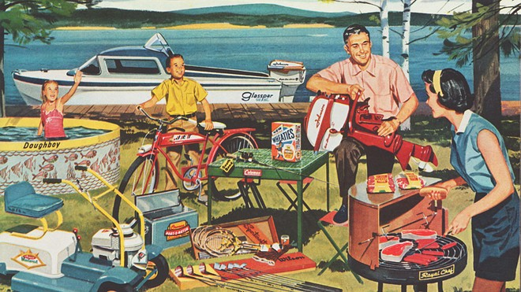
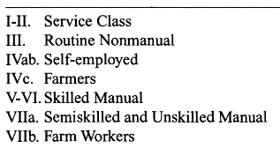
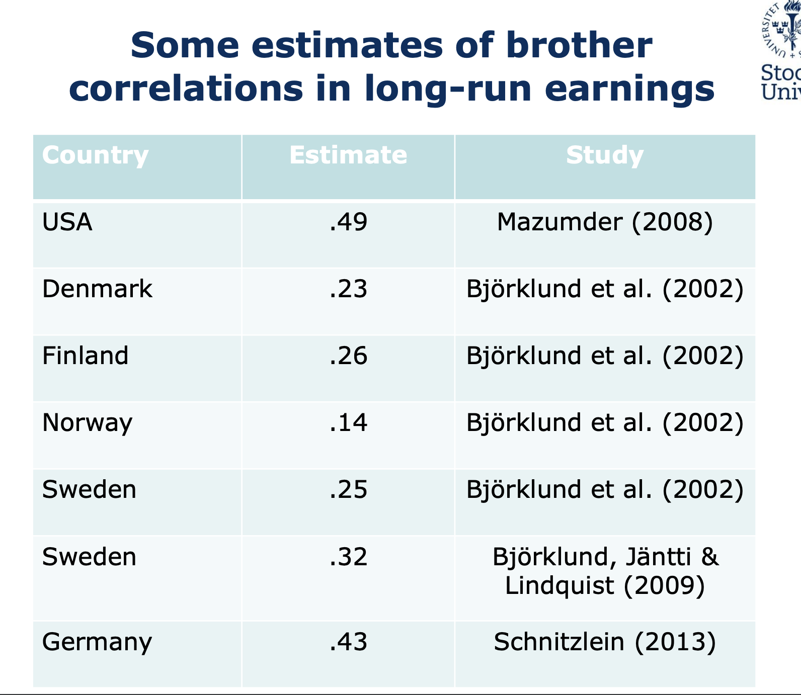

class: center, middle
```{r, echo=F, message=F, warning=F}
library("tidyverse")
library("ineq")

```





---
## Nociones recurrentes en discurso público

<br>
<br>
--

- Movilidad social ascendente

<br>
--

- "American Dream", movilidad ascendente larga ("rags-to-riches")  

<br>
--

- Movilidad social para todos, "Land of Opportunity"


<br>
--

- (más sutil)  igualdad de oportunidades, meritocracia. 

  - Movilidad como alternativa a desigualdad 

---
class: inverse, center, middle

## Movilidad social intergeneracional 


---
## Dos tipos de movilidad 

<br>
<br>
<br>
<br>
--

  - .bold[Movilidad absoluta:] comparación con respecto a posición de los padres (ascendente,inmovil, descendente): quién se mueve, cuánto y hacia donde. 
  
<br>
--

- .bold[Movilidad relativa:] comparación con respecto a posición relativa de los padres: ¿Cuán importante son los "accidentes de la cuna" para determinar el destino de una persona?


---
## Sociedad A

.pull-left[

<br>
<br>
<br>

|   **Padres**  |   **Hijos**   |
|:-------------:|:-------------:|
|  5 (rank = 2) | 10 (rank = 2) |
| 10 (rank = 1) | 20 (rank = 1) |
]

--

.pull-right[

- Misma desigualdad económica en ambas generaciones (2:1).

- Todos los individuos tienen una mejor situación social/económica que sus padres. En esta sociedad todos experimentan .bold[movilidad absoluta] ascendente.

- Todos los individuos tienen el mismo "ranking" social/económico de sus padres. En esta sociedad no hay .bold[movilidad relativa].


]

---
## Sociedad B

.pull-left[

<br>
<br>
<br>

|   **Padres**  |   **Hijos**   |
|:-------------:|:-------------:|
|  5 (rank = 2) | 10 (rank = 2) |
| 10 (rank = 1) | 5  (rank = 1) |
]

--

.pull-right[

- Misma desigualdad económica en ambas generaciones (2:1).

- Algunos individuos tienen una mejor situación social/económica que sus padres y otras una peor situación. En esta sociedad algunos experimentan .bold[movilidad absoluta] ascendente y otros .bold[movilidad absoluta] descendente.

- Todos los individuos tienen un "ranking" social/económico  distinto al de sus padres. En esta sociedad hay .bold[movilidad relativa] perfecta.


]


---
## ¿Movilidad social con respecto a que?

<br>

- Clase social (clase ocupacional)

- Status (prestigio)

- Educación

- Ingresos 

- Riqueza

- Salud,

- Posición política, etc. 


---
class: inverse, center, middle

# Movilidad Intergeneracional de Clases

---
# Esquemas de clase

--

<br>
.pull-left[

]

--

.pull-right[

]


---
## Tablas de movilidad

```{r, echo=F, message=FALSE}
library("tidyverse")
library("vcd")
library("vcdExtra")

data("Yamaguchi87")
data <- Yamaguchi87
ctable <- xtabs(Freq ~ Son + Father+Country, data=Yamaguchi87)
ctable <- ctable[c(1,4,5),c(1,4,5),c(1,2)] 

ctable_usa <- ctable[,,1]
ctable_uk  <- ctable[,,2]


```

--

.pull-left[
.bold[Recuentos]
```{r, echo=F, message=FALSE}
#USA
cat("USA\n")
print(ctable_usa)

#UK
cat("UK\n")
print(ctable_uk)
```

]

--

.pull-right[
.bold[Probabilidades]
```{r, echo=F, message=FALSE}
#USA
cat("USA\n")
print(round(addmargins(prop.table(ctable_usa)),2))

#UK
cat("UK\n")
print(round(addmargins(prop.table(ctable_uk)),2))
```

]

---
## Tablas de movilidad: movilidad absoluta 


.pull-left[
.bold[Probabilidades]
```{r, echo=F, message=FALSE}
#USA
cat("USA\n")
print(round(addmargins(prop.table(ctable_usa)),2))

#UK
cat("UK\n")
print(round(addmargins(prop.table(ctable_uk)),2))
```

]

--

.pull-right[
.bold[P(Destino | Origen)]
```{r, echo=F, message=FALSE}
#USA
cat("USA\n")
print(round(addmargins(prop.table(ctable_usa,2),1),2))

#UK
cat("UK\n")
print(round(addmargins(prop.table(ctable_uk,2),1),2))

```

]

* Para hablar de movilidad "ascendente" o "descendente" debemos hacer supuestos sobre el ordenamiento de las clases (no siempre evidente).


---
## Tablas de movilidad: movilidad relativa (fluidez)


.pull-left[
.bold[Probabilidades]
```{r, echo=F, message=FALSE}
#USA
cat("USA\n")
print(round(addmargins(prop.table(ctable_usa)),2))

#UK
cat("UK\n")
print(round(addmargins(prop.table(ctable_uk)),2))
```

]

--

.pull-right[
.bold[Margins-free]
```{r, echo=F, message=FALSE}
#USA
cat("USA\n")
chi2_usa <- chisq.test((ctable_usa))
print(chi2_usa$stdres)

#UK
cat("UK\n")
chi2_uk <- chisq.test((ctable_uk))
print(chi2_uk$stdres)

```

]

---
## Modelos log-lineales para tablas de movilidad

<br>

.bold[Modelo Saturado:]


.pull-left[
$$\log(\mu_{ij}) = \lambda + \underbrace{\lambda_i^X + \lambda_j^Y}_{\text{márgenes}} + \overbrace{\lambda_{ij}^{XY}}^{\text{fluidez}}$$

]

.pull-right[

|   | Y=1 | Y=2 | ... | Y=j |
|---|-----|-----|-----|-----|
| X=1 | $\mu_{11}$ | $\mu_{12}$ | ... | $\mu_{1j}$ |
| X=2 | $\mu_{21}$ | $\mu_{22}$ | ... | $\mu_{2j}$ |
| ... | ... | ... | ... | ... |
| X=i | $\mu_{i1}$ | $\mu_{i2}$ | ... | $\mu_{ij}$ |

]

<br>

Donde,

- $\mu_{ij}$ es el recuento esperado para la celda en el nivel $i$ de la variable $X$ y el nivel $j$ de la variable $Y$.
- $\lambda_i^X$ es el efecto del nivel $i$ de $X$.
- $\lambda_j^Y$ es el efecto del nivel $j$ de $Y$.
- $\lambda_{ij}^{XY}$ representa interacción entre $X_i$ y $Y_j$.
- $\lambda$'s corresponden a odd-ratios


---
## Modelos log-lineales para tablas de movilidad

.bold[Patrón de fluidez] (topologias). Ejemplos:


.pull-left[

|   | Y=1 | Y=2 | ... | Y=j |
|---|-----|-----|-----|-----|
| X=1 | 1 | 0 | ... | 0 |
| X=2 | 0 | 1 | ... | 0 |
| ... | ... | ... | 1 | ... |
| X=i | 0 | 0 | ... | 1 |


]
.pull-right[

|   | Y=1 | Y=2 | ... | Y=j |
|---|-----|-----|-----|-----|
| X=1 | 1 | 0 | ... | 0 |
| X=2 | 0 | 2 | ... | 0 |
| ... | ... | ... | 3 | ... |
| X=i | 0 | 0 | ... | i |

]

<br>
--

.center[

]

---
## Patrón y fuerza de la fluidez

.center[

]

---
class: inverse, center, middle

# Movilidad Intergeneracional de Ingresos

---
class: center, middle

## Medición 1: Elasticidad intergeneracional de ingresos

---
## Elasticidad intergeneracional de ingresos


$$\log y^{\text{child}} = \alpha + \beta \log y^{\text{par}} + \varepsilon$$
<br>
--

- $\alpha$ desplazamiento constante de ingresos entre una generación y la otra (ej. crecimiento)

- $y^{\text{child}}$ ingreso permanente hijo

- $y^{\text{par}}$ ingreso permanente padres

- $\varepsilon$ lo que el dinero de los padres no explica

--

- $IGE: \beta = \frac{\%\Delta y^{\text{child}}}{\%\Delta y^{\text{par}}}$ (elasticidad, IGE)

--

- $(1 - \beta)$ es un índice de movilidad social.

--

Notar que:

- $\text{IGE} = \underbrace{\rho}_{\text{correlación intergeneracional del ingresos}} \times  \frac{\sigma_{y^{\text{child}}}}{\sigma_{y^{\text{par}}}}$

---
## Elasticidad intergeneracional de ingresos


```{r, echo=FALSE}
library("tidyverse")
library("ggplot2")
library("ggsci")
library("cowplot")

jitter <- position_jitter(width = 0.03, height = 0)

n = 10000
x = rlnorm(n, meanlog = 0, sdlog = 1)
logx = log(x)
```

.bold[Inmovilidad relativa perfecta]: $\beta=1$

```{r, echo=FALSE, fig.height=4, fig.width=7, message=FALSE, warning=FALSE}
logy = 0 + 1*logx + rnorm(n,0,1/2)
data <- tibble(x=logx, y=logy, z=round(x,0), mob=if_else(y>x,"Ascendente","Descendente"), zz=ifelse(z==-4,1,ifelse(z==4,2,0))) 

data %>% ggplot(aes(x=x,y=y)) + geom_point(aes(colour=mob),alpha=0.7) + geom_smooth(method = "lm", se = FALSE) + ylim(-4,4) + xlim(-4,4) + labs(x="Ingreso permanente hijos (log)", y="Ingreso permanente hijos (log)", subtitle="Elasticidad intergeneracional de ingresos (IGE)",
colour=NULL)   +
theme_minimal() +
  theme(
    axis.text.y = element_text(size = 22),
    axis.text.x = element_text(size = 22),
    axis.title.y = element_text(size = 24),
    axis.title.x = element_text(size = 24),
    panel.border = element_rect(color = "black", fill = NA, linewidth = 1)
  )

```

---
## Elasticidad intergeneracional de ingresos

.bold[Movilidad relativa perfecta]: $\beta=0$

```{r, echo=FALSE, fig.height=4, fig.width=7, message=FALSE, warning=FALSE}
logy = 0 + 0*logx + rnorm(n,0,1/2)
data <- tibble(x=logx, y=logy, z=round(x,0), mob=if_else(y>x,"Ascendente","Descendente"), zz=ifelse(z==-4,1,ifelse(z==4,2,0))) 

data %>% ggplot(aes(x=x,y=y)) + geom_point(aes(colour=mob),alpha=0.7) + geom_smooth(method = "lm", se = FALSE) + ylim(-4,4) + xlim(-4,4) + labs(x="Ingreso permanente hijos (log)", y="Ingreso permanente hijos (log)", subtitle="Elasticidad intergeneracional de ingresos (IGE)",
colour=NULL) +
    theme_minimal() +
  theme(
    axis.text.y = element_text(size = 22),
    axis.text.x = element_text(size = 22),
    axis.title.y = element_text(size = 24),
    axis.title.x = element_text(size = 24),
    panel.border = element_rect(color = "black", fill = NA, linewidth = 1)
  )

```

---
## Elasticidad intergeneracional de ingresos

.bold[Baja tasa de movilidad relativa]: $\beta=0.5$

```{r, echo=FALSE, fig.height=4, fig.width=7, message=FALSE, warning=FALSE}
logy = 0 + 0.5*logx + rnorm(n,0,1/2)
data <- tibble(x=logx, y=logy, z=round(x,0), mob=if_else(y>x,"Ascendente","Descendente"), zz=ifelse(z==-4,1,ifelse(z==4,2,0))) 

data %>% ggplot(aes(x=x,y=y)) + geom_point(aes(colour=mob),alpha=0.7) + geom_smooth(method = "lm", se = FALSE) + ylim(-4,4) + xlim(-4,4) + labs(x="Ingreso permanente hijos (log)", y="Ingreso permanente hijos (log)", subtitle="Elasticidad intergeneracional de ingresos (IGE)",
colour=NULL) +
    theme_minimal() +
  theme(
    axis.text.y = element_text(size = 22),
    axis.text.x = element_text(size = 22),
    axis.title.y = element_text(size = 24),
    axis.title.x = element_text(size = 24),
    panel.border = element_rect(color = "black", fill = NA, linewidth = 1)
  )

```

---
## Movilidad relativa y movilidad absoluta

.pull-left[

$\beta$ = 0.5 + crecimiento

```{r, echo=FALSE, fig.height=4, fig.width=7, message=FALSE, warning=FALSE}
logy = 2 + 0.5*logx + rnorm(n,0,1/2)
data <- tibble(x=logx, y=logy, z=round(x,0), mob=if_else(y>x,"Ascendente","Descendente"), zz=ifelse(z==-4,1,ifelse(z==4,2,0))) 

data %>% ggplot(aes(x=x,y=y)) + geom_point(aes(colour=mob),alpha=0.7) + geom_smooth(method = "lm", se = FALSE) + ylim(-4,4) + xlim(-4,4) + labs(x="Ingreso permanente hijos (log)", y="Ingreso permanente hijos (log)", subtitle="Elasticidad intergeneracional de ingresos (IGE)",
colour=NULL) +
    theme_minimal() +
  theme(
    axis.text.y = element_text(size = 22),
    axis.text.x = element_text(size = 22),
    axis.title.y = element_text(size = 24),
    axis.title.x = element_text(size = 24),
    panel.border = element_rect(color = "black", fill = NA, linewidth = 1)
  )

```
]

.pull-right[

$\beta$ = 0.5 + decrecimiento

```{r, echo=FALSE, fig.height=4, fig.width=7, message=FALSE, warning=FALSE}
logy = -2 + 0.5*logx + rnorm(n,0,1/2)
data <- tibble(x=logx, y=logy, z=round(x,0), mob=if_else(y>x,"Ascendente","Descendente"), zz=ifelse(z==-4,1,ifelse(z==4,2,0))) 

data %>% ggplot(aes(x=x,y=y)) + geom_point(aes(colour=mob),alpha=0.7) + geom_smooth(method = "lm", se = FALSE) + ylim(-4,4) + xlim(-4,4) + labs(x="Ingreso permanente hijos (log)", y="Ingreso permanente hijos (log)", subtitle="Elasticidad intergeneracional de ingresos (IGE)",
colour=NULL) +
    theme_minimal() +
  theme(
    axis.text.y = element_text(size = 22),
    axis.text.x = element_text(size = 22),
    axis.title.y = element_text(size = 24),
    axis.title.x = element_text(size = 24),
    panel.border = element_rect(color = "black", fill = NA, linewidth = 1)
  )

```
]

---
## Elasticidad intergeneracional de ingresos: ventajas y limitaciones

.pull-left[

]

--

.pull-right[

- Simple y comparable

- No captura patrones, sólo nivel


]

---
class: center, middle

## Medición 2: Correlaciones entre herman@s

---
## Correlaciones entre herman@s

.center[

]

---
## Correlaciones entre herman@s

.center[
```{r, warning=F, message=F, echo=F}
set.seed(839911)
data <- tibble(x=logx, y=logy, z=round(x,0), zz=ifelse(z==-4,1,ifelse(z==4,2,0))) 

data %>% ggplot(aes(x=y)) + geom_density(fill="grey", alpha=0.3) + ylim(0,1.5) +  geom_point(aes(x=x, y=0,group=factor(zz),colour=factor(zz)), position = jitter, alpha=0.9, size=3) + scale_colour_manual(values = c("1" = "red","2"="blue","0"=NA)) + 
  labs(y="", x="Permanent log-income", colour="Familias") +
    theme_minimal() +
  theme(
    axis.text.y = element_text(size = 22),
    axis.text.x = element_text(size = 22),
    axis.title.y = element_text(size = 24),
    axis.title.x = element_text(size = 24),
    panel.border = element_rect(color = "black", fill = NA, linewidth = 1)
  )

```

]


---
##Correlaciones entre herman@s

<br>
.bold[Intuición]:

--
<br>

- herman@s comparten genes y ambiente (por ejemplo, familia, escuela, barrio).

--

- Si ambiente y factores genéticos son importantes para la obtención de resultados socioeconómico, los herman@s obtendrían resultados similares entre sí.

--

- Mayor similitud en resultados indicaría mayor influencia atribuible a los antecedentes familiares y comunitarios.


---
## Correlaciones entre herman@s

$$y_{ij} = \underbrace{a_{j}}_{\text{componente familiar}} + \underbrace{\mu_{ij}}_{\text{componente idiosincrático}}$$
<br>
<br>
--

¿Que fracción de la variabilidad en ingresos occurre dentro de las familias (en vez de entre-familias)?

<br>

$$\rho = \frac{\sigma^{2}_{a}}{\sigma^{2}_{a}+\sigma^{2}_{\mu}}$$
<br>
--

- Correlación entre herman@s proporciona un límite superior para la influencia intergeneracional combinada de los factores genéticos y ambientales.

- Generalmente arroja un mejor poder predictivo que la IGE.


---
##  Correlaciones entre herman@s: ventajas y limitaciones


.pull-left[

]

--

.pull-right[

- Simple y comparable

- No captura patrones, sólo nivel

- Asume que hijos experimentan mismos padres y entorno

- Asume que factores no compartidos son idiosincráticos


]


---
class: inverse, center, middle

##Hasta la próxima clase. Gracias!


<br>
Mauricio Bucca <br>
https://mebucca.github.io/ <br>
github.com/mebucca


