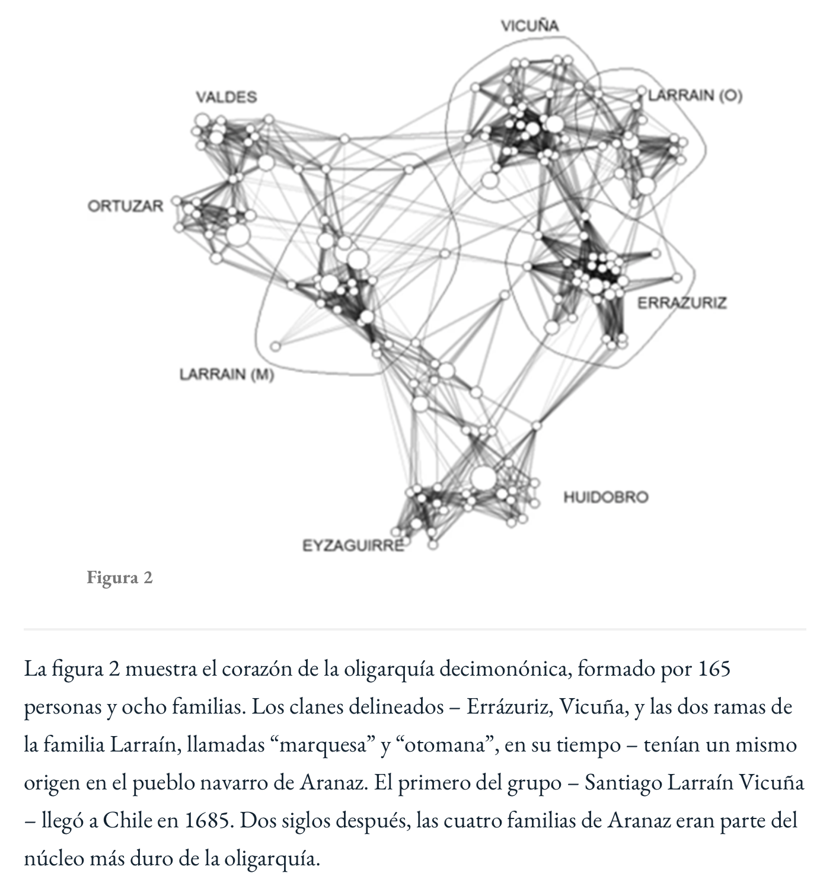
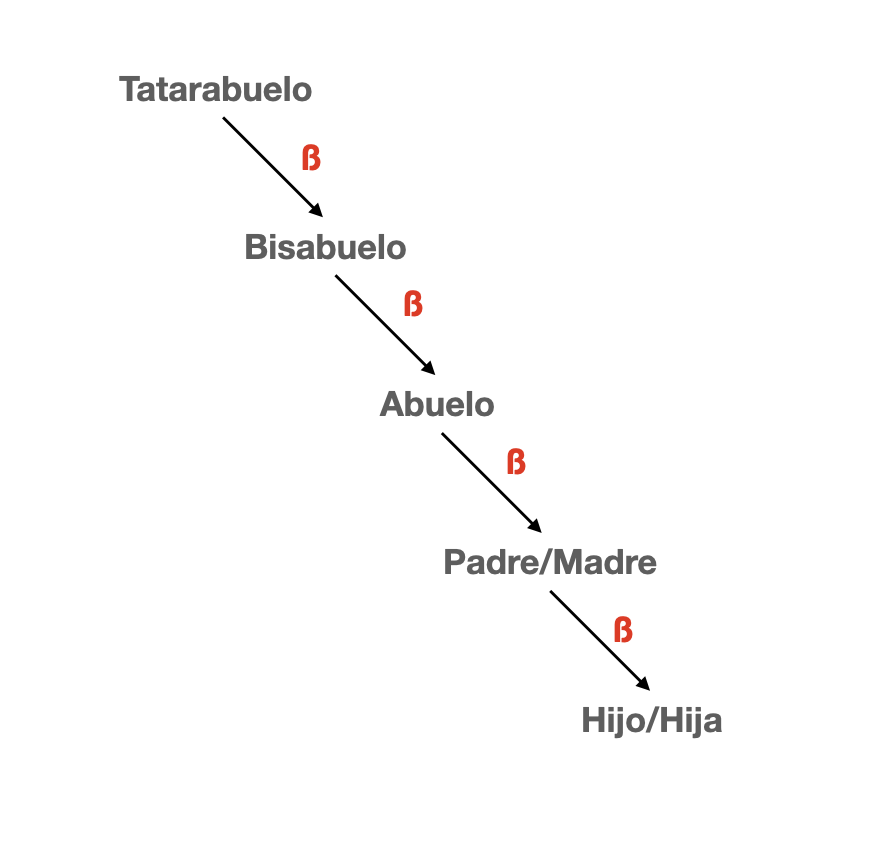
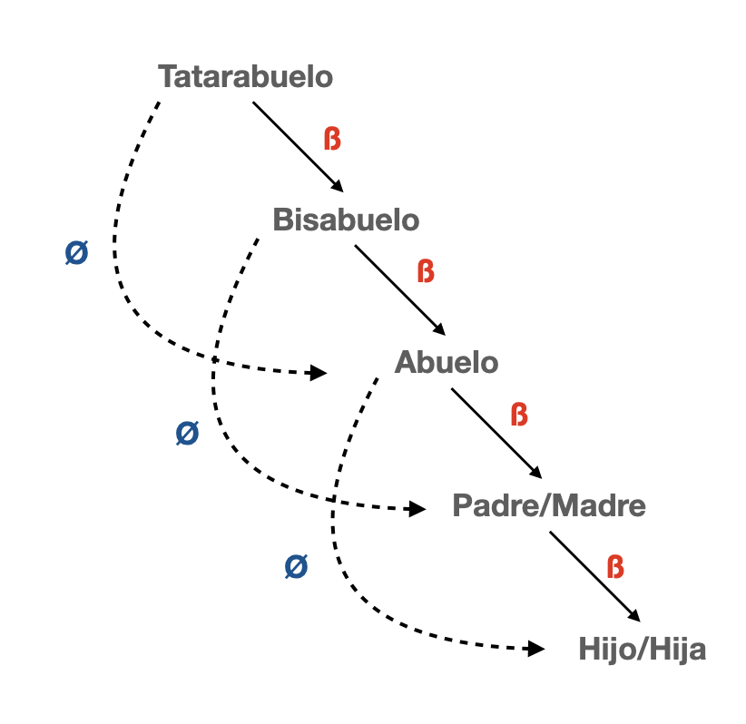
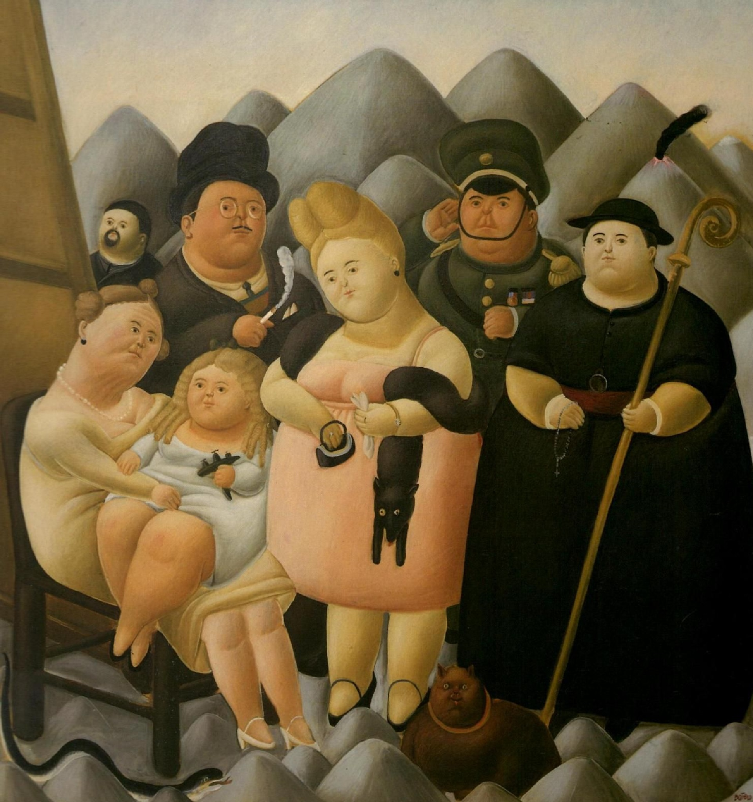

```{r, echo=F, message=F, warning=F,  out.width = '300px'}
library("tidyverse")
library("ineq")

theme_set(theme_bw())
options(digits=3, scipen = 100)
```


---
## Movilidad Social

- movilidad social para todos?

---
## Movilidad Social


### Sociedad A

.pull-left[
|   **Padres**  |   **Hijos**   |
|:-------------:|:-------------:|
|  5 (rank = 2) | 10 (rank = 2) |
| 10 (rank = 1) | 20 (rank = 1) |
]
.pull-right[

- Misma desigualdad económica en ambas generaciones (2:1).

- Todos los individuos tienen una mejor situación social/económica que sus padres. En esta sociedad todos experimentan .bold[movilidad absoluta] ascendente.

- Todos los individuos tienen el mismo "ranking" social/económico de sus padres. En esta sociedad no hay .bold[movilidad relativa].


]

---
## Movilidad Social


### Sociedad B

.pull-left[
|   **Padres**  |   **Hijos**   |
|:-------------:|:-------------:|
|  5 (rank = 2) | 10 (rank = 2) |
| 10 (rank = 1) | 5  (rank = 1) |
]
.pull-right[

- Misma desigualdad económica en ambas generaciones (2:1).

- Algunos individuos tienen una mejor situación social/económica que sus padres y otras una peor situación. En esta sociedad algunos experimentan .bold[movilidad absoluta] ascendente y otros .bold[movilidad absoluta] descendente.

- Todos los individuos tienen el mismo "ranking" social/económico de sus padres. En esta sociedad no hay .bold[movilidad relativa].


]


---
## Movilidad Social


### Elasticidad intergeneracional de ingresos

$$y^{\text{child}} = \alpha + \beta y^{\text{par}} + \varepsilon$$
$(1 - \beta)$ es un índice de movilidad social.

---
## Elasticidad intergeneracional de ingresos


```{r, echo=FALSE}
library("tidyverse")
library("ggplot2")
library("ggsci")
library("cowplot")

jitter <- position_jitter(width = 0.03, height = 0)

n = 10000
x = rlnorm(n, meanlog = 0, sdlog = 1)
logx = log(x)
```

beta=1

```{r, warning=F, message=F, echo=F}
logy = 0 + 1*logx + rnorm(n,0,1/2)
data <- tibble(x=logx, y=logy, z=round(x,0), mob=if_else(y>x,1,0), zz=ifelse(z==-4,1,ifelse(z==4,2,0))) 

data %>% ggplot(aes(x=x,y=y, colour=mob)) + geom_point(alpha=0.07) + geom_smooth(method = "lm", se = FALSE) + ylim(-4,4) + xlim(-4,4) + labs(x="Ingreso permanente hijos (log)", y="Ingreso permanente hijos (log)", subtitle="Elasticidad intergeneracional de ingresos (IGE)",
colour=NULL) + theme(legend.position = "none")
```

---
## Elasticidad intergeneracional de ingresos

beta=0

```{r, warning=F, message=F, echo=F}
logy = 0 + 0*logx + rnorm(n,0,1/2)
data <- tibble(x=logx, y=logy, z=round(x,0), mob=if_else(y>x,1,0), zz=ifelse(z==-4,1,ifelse(z==4,2,0))) 

data %>% ggplot(aes(x=x,y=y, colour=mob)) + geom_point(alpha=0.07) + geom_smooth(method = "lm", se = FALSE) + ylim(-4,4) + xlim(-4,4) + labs(x="Ingreso permanente hijos (log)", y="Ingreso permanente hijos (log)", subtitle="Elasticidad intergeneracional de ingresos (IGE)",
colour=NULL) + theme(legend.position = "none")
```

---
## Elasticidad intergeneracional de ingresos

beta=0.5

```{r, warning=F, message=F, echo=F}
logy = 0 + 0.5*logx + rnorm(n,0,1/2)
data <- tibble(x=logx, y=logy, z=round(x,0), mob=if_else(y>x,1,0), zz=ifelse(z==-4,1,ifelse(z==4,2,0))) 

data %>% ggplot(aes(x=x,y=y, colour=mob)) + geom_point(alpha=0.07) + geom_smooth(method = "lm", se = FALSE) + ylim(-4,4) + xlim(-4,4) + labs(x="Ingreso permanente hijos (log)", y="Ingreso permanente hijos (log)", subtitle="Elasticidad intergeneracional de ingresos (IGE)",
colour=NULL) + theme(legend.position = "none")
```

---
## Elasticidad intergeneracional de ingresos

beta=0.5 + crecimiento

.pull-left[
```{r, warning=F, message=F, echo=F}
logy = 2 + 0.5*logx + rnorm(n,0,1/2)
data <- tibble(x=logx, y=logy, z=round(x,0), mob=if_else(y>x,1,0), zz=ifelse(z==-4,1,ifelse(z==4,2,0))) 

data %>% ggplot(aes(x=x,y=y, colour=mob)) + geom_point(alpha=0.07) + geom_smooth(method = "lm", se = FALSE) + ylim(-4,4) + xlim(-4,4) + labs(x="Ingreso permanente hijos (log)", y="Ingreso permanente hijos (log)", subtitle="Elasticidad intergeneracional de ingresos (IGE)",
colour=NULL) + theme(legend.position = "none")
```
]

.pull-right[
```{r, warning=F, message=F, echo=F}
logy = -2 + 0.5*logx + rnorm(n,0,1/2)
data <- tibble(x=logx, y=logy, z=round(x,0), mob=if_else(y>x,1,0), zz=ifelse(z==-4,1,ifelse(z==4,2,0))) 

data %>% ggplot(aes(x=x,y=y, colour=mob)) + geom_point(alpha=0.07) + geom_smooth(method = "lm", se = FALSE) + ylim(-4,4) + xlim(-4,4) + labs(x="Ingreso permanente hijos (log)", y="Ingreso permanente hijos (log)", subtitle="Elasticidad intergeneracional de ingresos (IGE)",
colour=NULL) + theme(legend.position = "none")
```
]


---
## Dinastias


.pull-left[


]
.pull-right[

]


---
## Dinastias

.pull-left[


]

.pull.right[
```{r, warning=F, message=F, echo=F}
library("modelr")
data_frame(x=NULL,gen=NULL) %>% data_grid(beta=c(0.3,0.5,0.8), gen=1:20) %>% mutate(ige=beta^gen) %>%
  ggplot(aes(x=gen,y=ige, group=factor(beta), colour=factor(beta) )) + geom_point() + geom_line() +
  labs(x="Generaciones", y="Elasticidad intergeneracional de ingresos (IGE)", colour="IGE 1 generación") +
  theme(legend.position = "bottom")
```
]

---
## Dinastias

.pull-left[

]

---
## Correlaciones entre hermanos


---
## Correlaciones entre hermanos

```{r, warning=F, message=F, echo=F}
data <- tibble(x=logx, y=logy, z=round(x,0), zz=ifelse(z==-4,1,ifelse(z==4,2,0))) 

data %>% ggplot(aes(x=y)) + geom_density(fill="grey", alpha=0.3)   + ylim(0,1.5) +  geom_point(aes(x=x, y=0,group=factor(zz),colour=factor(zz)), position = jitter, alpha=1, size=1.7) + scale_colour_manual(values = c("1" = "red","2"="blue","0"=NA)) + labs(y="", x="Permanent log-income Children", subtitle= "Sibling correlation in income (SC)") +  theme(axis.title.x=element_text(colour="white"), axis.text.x=element_text(colour="white"), axis.ticks.x=element_blank(), legend.position="none")
```

---
## Correlaciones entre hermanos

$$y_{ij} = \underbrace{a_{j}}_{\text{componente familiar}} + \underbrace{\mu_{ij}}_{\text{componente idiosincrático}}$$
<br>
<br>
--

¿Que fracción de la variabilidad en ingresos occurre dentro de las familias (en vez de entre-familias)?

<br>

$$\rho = \frac{\sigma^{2}_{a}}{\sigma^{2}_{a}+\sigma^{2}_{\mu}}$$

---
## Lecturas

<br>
Lecturas obligatorias:

<br>

1. David B. Grusky, Jasmine Hill; Inequality in the 21st Century, a reader; Taylor & Francis 2017; Chapter 1: Poverty and Inequality in the 21st Century, p.1-7.

2. John E. Roemer; Equality of Opportunity; Harvard University Press 1998.  Chapter 1 and Chapter 2.

3. Robert H. Frank; Success and Luck: Good Fortune and the Myth of Meritocracy, Chapter 3: How winner-take-all markets magnify luck's role.

4. Daniel Matamala; Pedro, Juan y Diego; La Tercera 2019.

---
## Lecturas

<br>
Lecturas complementarias:

<br>

1. Christopher Jencks; Inequality. A Reassessment of the Effect of Family and Schooling in America; Basic Books, Inc., Publishers 1971. Chapter 1: From Equal Opportunity to Equal Results, p.3-15.

2. Florencia Torche; Privatization Reform and Inequality of Educational Opportunity: The Case of Chile; Sociology of Education; 2005.

3. Javier Nunez, Andrea Tartakowsky; The relationship between income inequality and inequality of opportunities in a high-inequality country: the case of Chile; Applied Economics Letters; 2011.


---
## Material del curso

Todo el material del curso será almacenado y actualizado regularmente en repositorio `Github`:

<br>
.center[


https://github.com/mebucca/sdd_sol186s
]


---
class: inverse, center, middle

.huge[
**Hasta la próxima clase. Gracias!**
]

<br>
Mauricio Bucca <br>
https://mebucca.github.io/


