class: inverse, center, middle

## Modelos teóricos - mecanísmos

---
## Movilidad social: origen-destino

.center[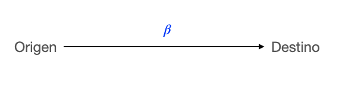]

 
--

Por ejemplo, transmisión intergeneracional de ingresos:
$$D = \alpha + \beta O$$

 
donde $\beta$ es la "elasticidad intergenacioal de ingresos"

---
## Triángulo OED (origen-educación-destino)

.center[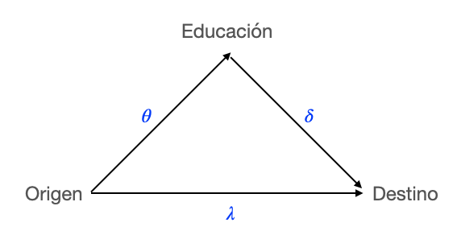]

 
--

Constinuando con el ejemplo de transmisión intergeneracional de ingresos:
$$E = \theta O$$
$$D = \delta E + \lambda O = \underbrace{(\delta  \theta + \lambda) }_{\beta} O $$

 
donde $\beta$ es la "elasticidad intergenacioal de ingresos"

---
## Modelo Wisconsin de logro de Status (Sewell & Portes, 70's)

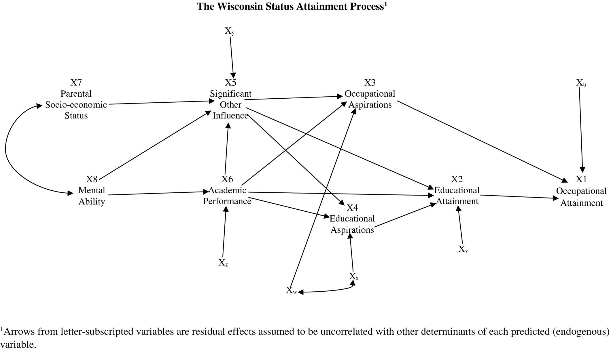
---
## Modelo Becker-Tomes (80's)

.center[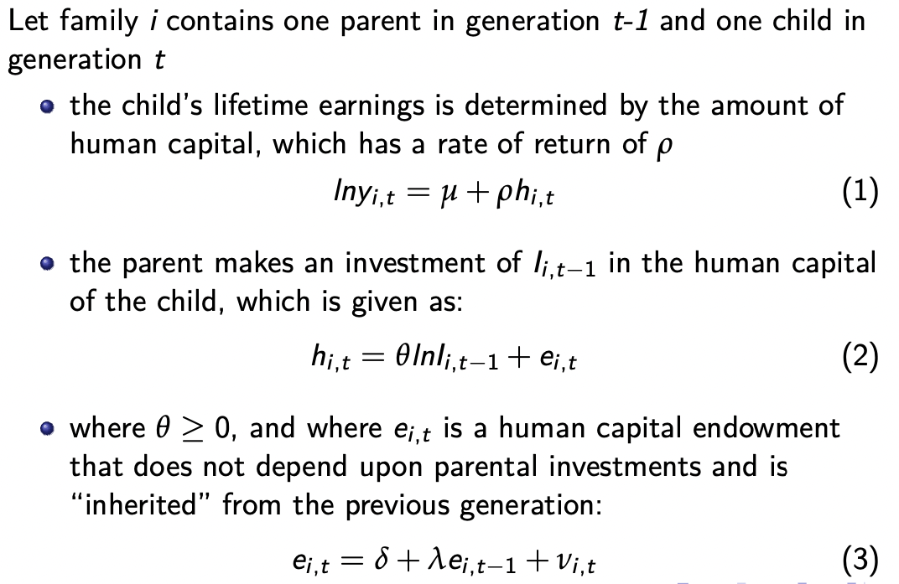]

https://milescorak.files.wordpress.com/2018/05/econ_87100_lecture_4_intergenerational_mobility_in_theory.pdf

---
## Algunas fuentes de variación en tasas de movilidad a través del tipo y lugares

.center[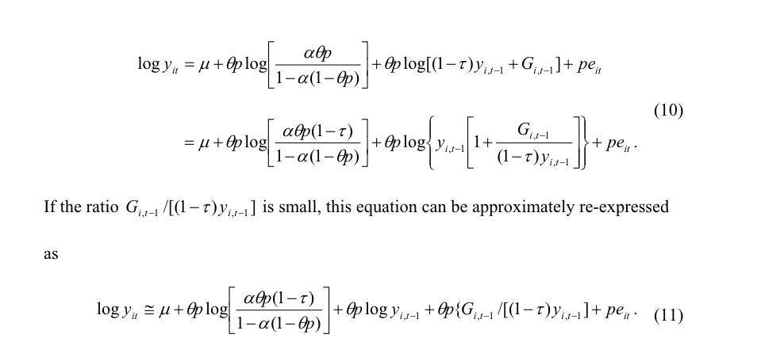]

---
## Algunas fuentes de variación en tasas de movilidad a través del tipo y lugares

 

4 factores:

- Importancia de transmisión mecánica de ventajas/desventajas (genes, prácticas de crianza, etc.)

- Eficacia de inversión en capital humano

- Progresividad de inversión pública en capital humano

- Retornos económicos del capital humano

---
### Es un grado universitario un igualador oportunidades?

Hout 1980 & Torche 2011

.center[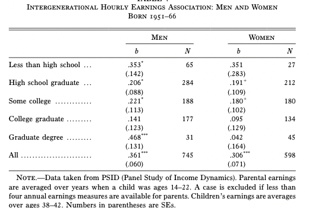]

---
class: inverse, center, middle

## Tendencias temporales

---
## Tendencias históricas: movilidad absoluta de clase

.pull-left[.bold[Hombres]

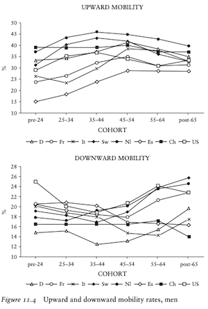
]
.pull-right[.bold[Mujeres]

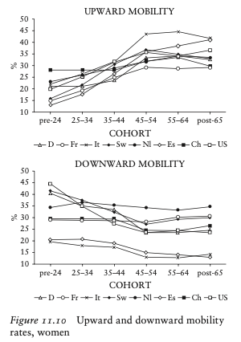
]

---
## Tendencias históricas: movilidad absoluta de ingresos

.center[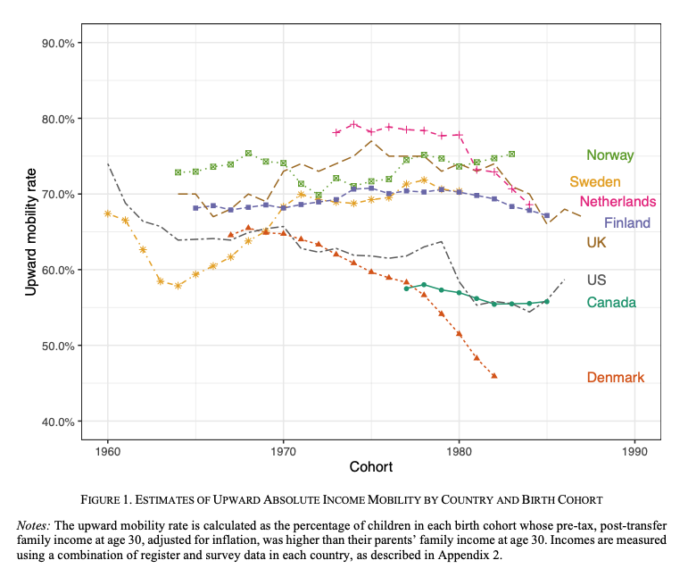]

---
## Tendencias históricas: movilidad relativa de clase

 
.center[.bold[Hombres]

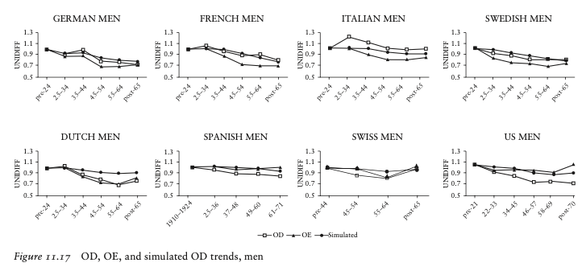
]

---
## Tendencias históricas: movilidad relativa de clase

 
.center[.bold[Mujeres]

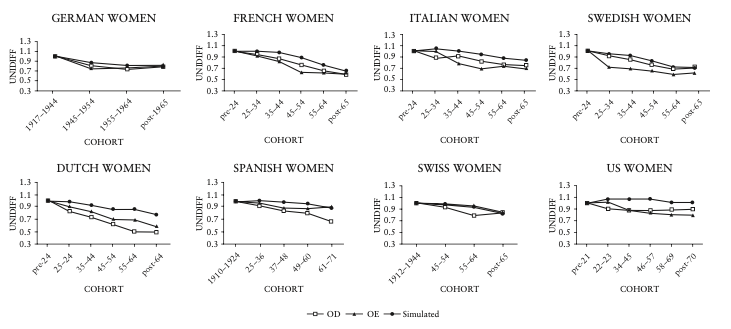
]

---
class: inverse, center, middle

## Variación de lugar a lugar

---
## Comparaciones internacionales movilidad relativa de ingresos

Jantti et al 2006: American Exceptionalism?

.center[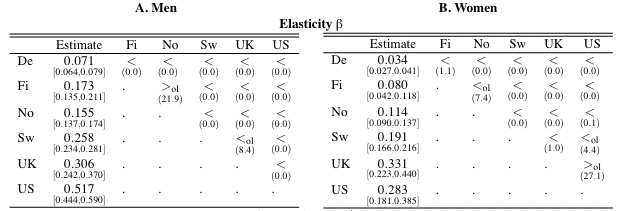]

---
## Comparaciones internacionales movilidad relativa de ingresos

Bladen 2013
.center[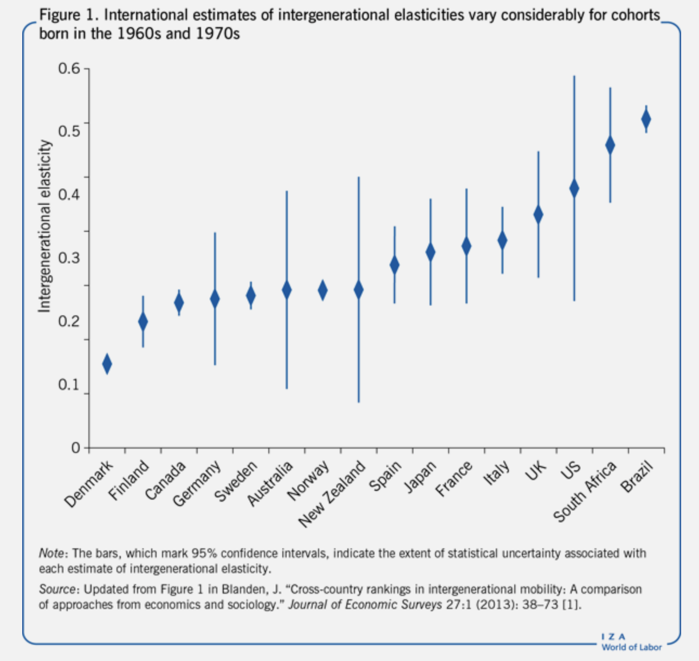]

---
## Comparaciones internacionales movilidad relativa de ingresos

Y Chile? Meneses 2022

.center[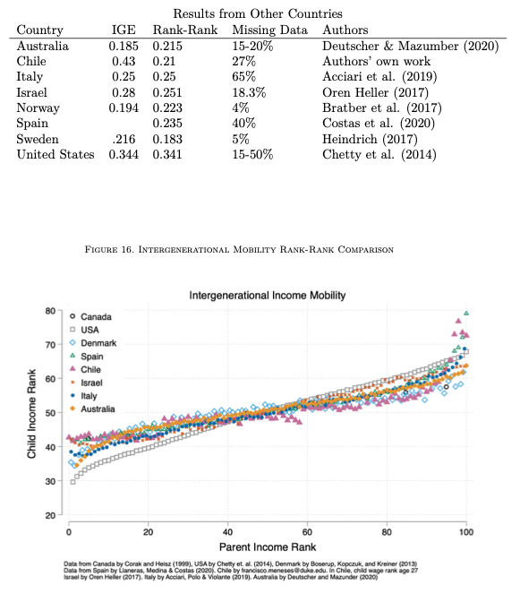]

---
## Comparaciones internacionales movilidad relativa de clase

- Golthorpe and Eriksson (1992) - The Constant Flux, Class Mobility in Industrial Societies

.center[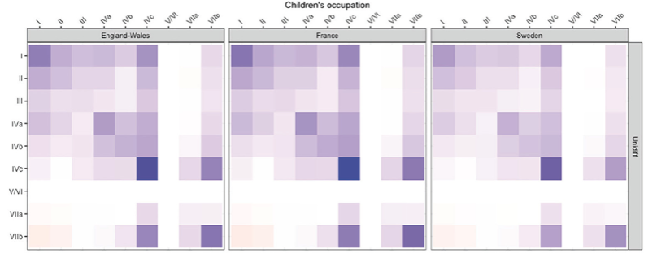]

.bold[I] Service class I (top class); .bold[II] Service class II (lower-grade professionals); .bold[III] Routine non manual; .bold[IVa] Self-empl with employees; .bold[IVb] Self-empl with no empoyees; .bold[IVc] Farmers; .bold[VI] Skilled workers; .bold[VIIa] Unskilled workers; .bold[VIIb] Farm labours. 

---
## Material del curso

Todo el material del curso será almacenado y actualizado regularmente en repositorio `Github`:

 
.center[

https://github.com/mebucca/sdd_sol186s
]

---
class: inverse, center, middle

.huge[
**Hasta la próxima clase. Gracias!**
]

 
Mauricio Bucca  
https://mebucca.github.io/

