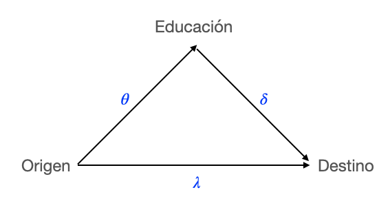
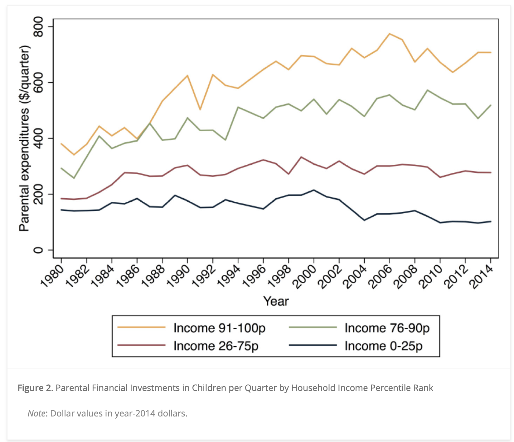
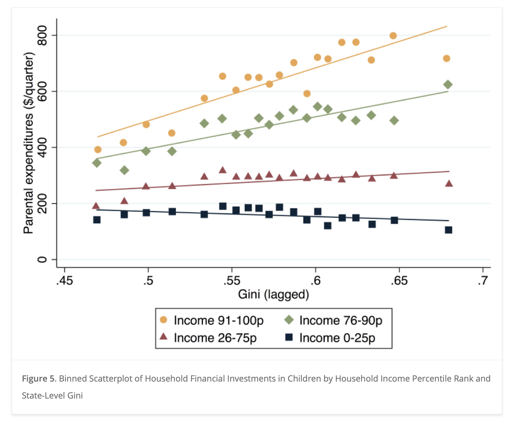
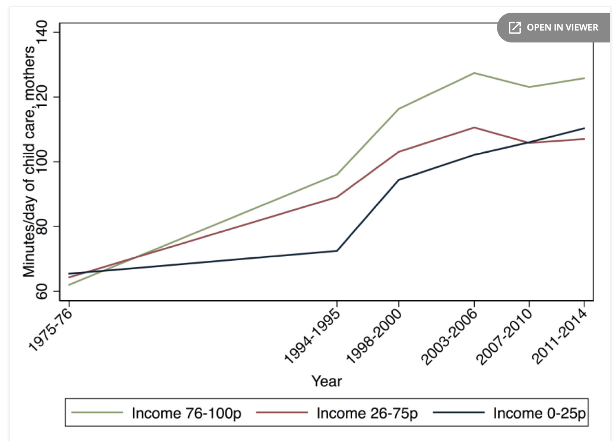
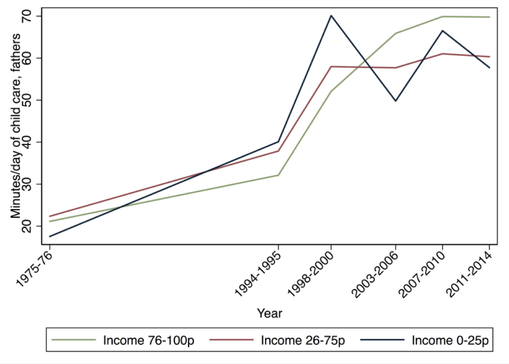
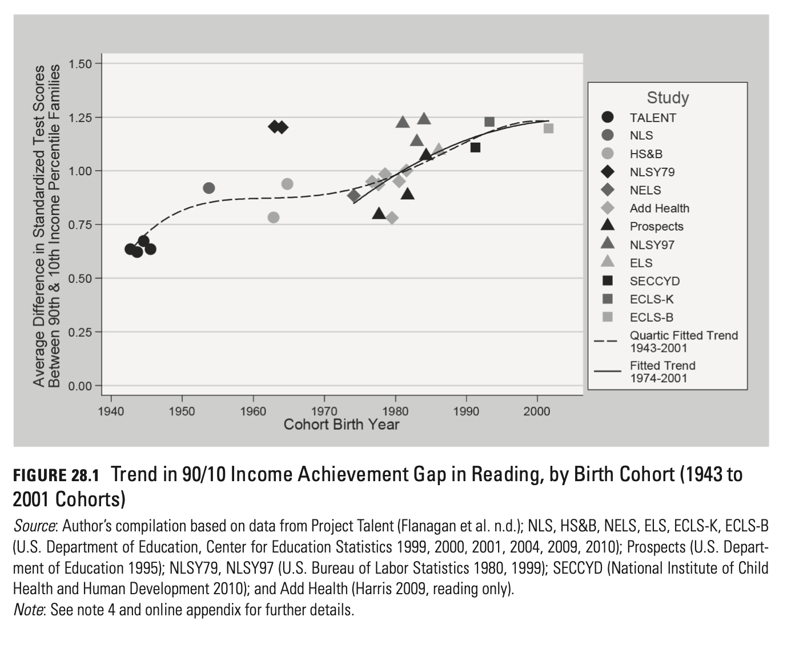
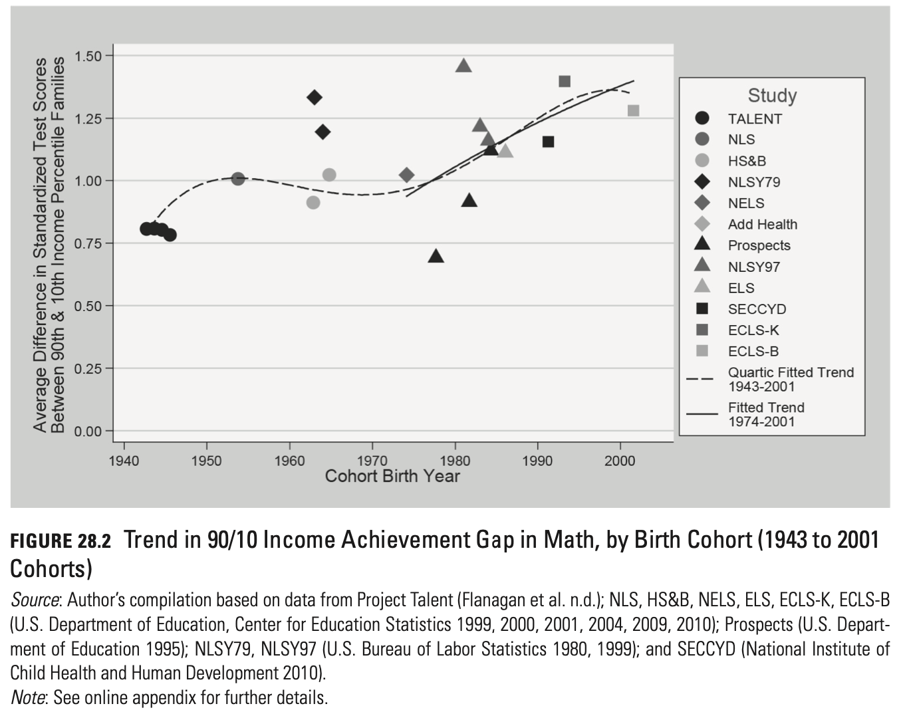
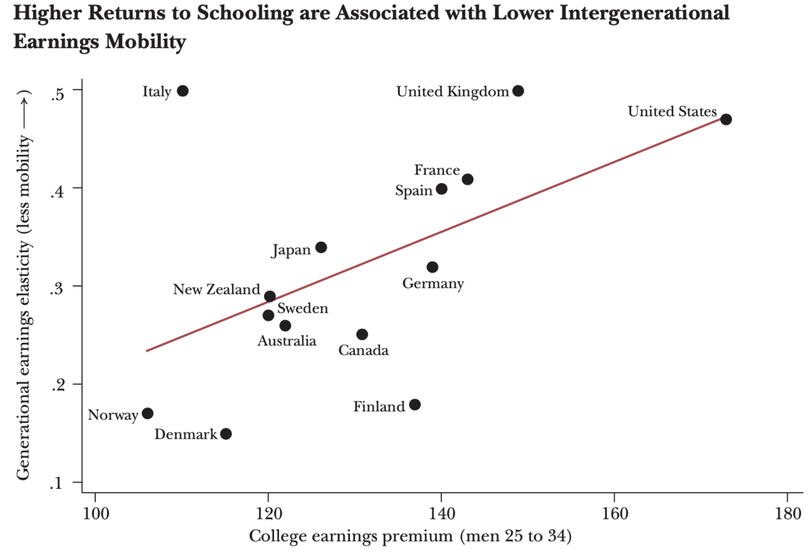
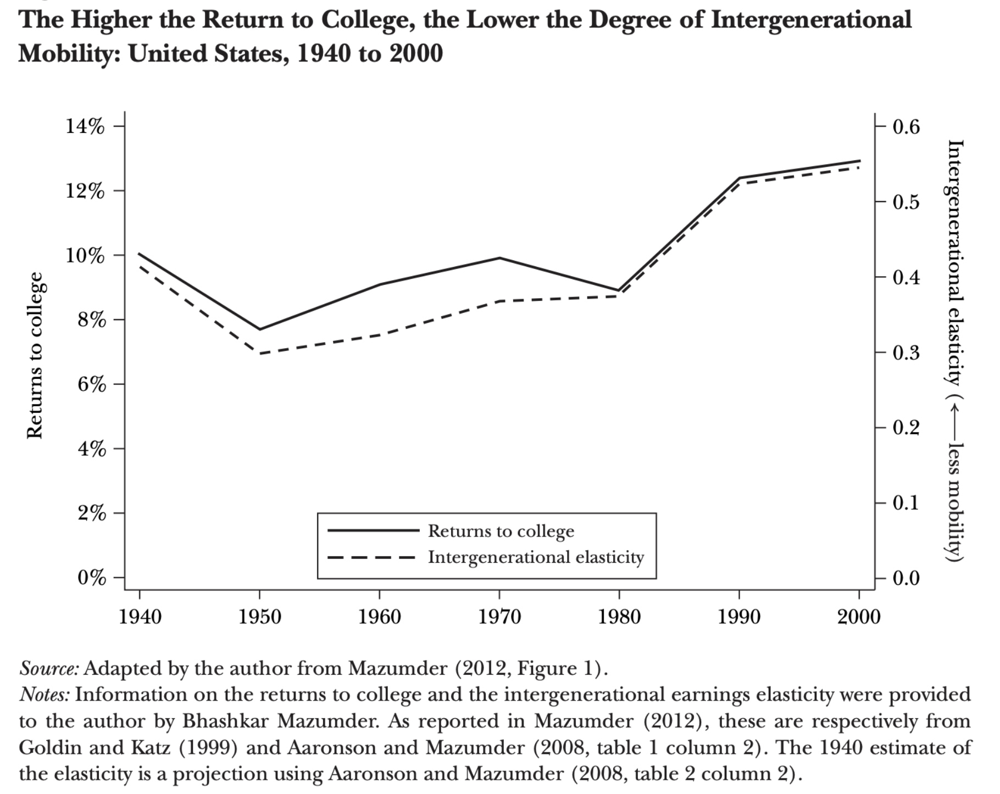

class: center, middle

---
class: inverse, center, middle

# Pobreza y Desigualdad

---
## Pobreza y Desigualdad

 

.pull-left[

]
.pull-right[
### “So long as the gap is smaller, they would rather have the poor poorer"
#### [`[video]`](https://youtu.be/GvB6xvFQLmQ?t=17) 
]

---
## Triángulo pobreza-crecimiento-desigualdad 

 

El cambio en la tasa de pobreza absoluta puede descomponerse en dos componentes principales (Datt & Ravallion, 1992):

 
--

1. .bold[Efecto crecimiento:] Variación en pobreza atribuible a cambios en el ingreso medio, manteniendo constante la distribución del ingreso.

2. .bold[Efecto redistribución:] Variación en pobreza atribuible a cambios en la desigualdad, manteniendo constante el ingreso medio.
 

 
.center[
#### [`[DESCOMPOSICIÓN DATT-RAVALLION]`](https://mebucca810.shinyapps.io/class_2/)
]

---
## Triángulo pobreza-crecimiento-desigualdad 

.bold[Debates:]

 
--

.bold[Trade-off entre crecimiento y distribución:]

  - Visiones económicas ortodoxas sugieren que redistribuir puede generar desincentivos a la inversión y al esfuerzo individual (ej. disposición a trabajar). 
  
  - Investigaciones recientes muestran que altos niveles de desigualdad pueden  obstaculizar el crecimiento al restringir el capital humano, generar inestabilidad social o limitar la demanda agregada.

 
--

.bold[Crecimiento pro-pobre]

  - Se habla de crecimiento “pro-pobre” (pro-poor growth) cuando los ingresos de las personas en situación de pobreza crecen más rápido que los del promedio de la población. Es decir, crecimiento y mejoras distributivas pueden ayudar conjuntamente a reducir la pobreza.

---
class: inverse, center, middle

# Desigualdad y Movilidad

---
class: center, middle

.pull-left[
#### "Consider two societies that have the same annual distribution of income. In one there is great mobility and change so that the position of particular families in the income hierarchy varies widely from year to year. In the other, there is great rigidity so that each family stays in the same position year after year. The one kind of inequality is a sign of dynamic change, social mobility, equality of opportunity; the other, of a status society" 

#### (Friedman 1962)
]

--

.pull-right[

]

---
## Desigualdad y movilidad

- Desigualad y movilidad son analíticamente distintos y pueden ser pensados como independientes entre si

.pull-left[
### Sociedad A

|   **Padres**  |   **Hijos**   |
|:-------------:|:-------------:|
|  5  | 10  |
| 10  | 5   |
]

.pull-right[
### Sociedad B

|   **Padres**  |   **Hijos**   |
|:-------------:|:-------------:|
|  5  | 5  |
|  6  | 6  |
]

 
--

- Trade-off entre desigualdad y movilidad?

---
# pero ... The Great Gatsby Curve!

--

.pull-left[

]

.pull-left[

]

---
# The Great Gatsby Curve

 

.pull-left[
 
Basado en Corak 2013
]

.pull-right[
### No existen sociedades reales que combinen alta desigualdad de resultados con alta tasas de movilidad social
]

---
# The Great Gatsby Curve: ¿Por que?

 
--
.pull-left[

]

.pull-right[

.bold[Algunas fuentes de variación en tasas de movilidad ]

 

- (λ) Importancia de transmisión mecánica de ventajas/desventajas (genes, prácticas de crianza, etc.)

- (θ) Inversión en capital humano de los padres

- (δ) Retornos económicos del capital humano

- Progresividad de inversión pública 

]

 
 
--

.bold[¿Están relacionados estos factores con el nivel de desigualdad de una sociedad?]

---
## (i) Inversión en capital humano de los hijos

--
 

.pull-left[
.center[]
]

--

.pull-right[
- .bold[Opportunity markets]: los padres no pueden comprar directamente posición social para sus hijos, pero pueden comprar oportunidades indirectamente a través del acceso ventajoso a las escuelas, vecindarios e información que crean mérito, etc.

- .bold[Feedback loop entre desigualdad y movilidad]: en contextos más desiguales el costo fallar es más alto, por que los padres invierten más en sus hijos 

]

---
## (i) Inversión en capital humano de los hijos

--
 

.bold[Gasto por hijos según decil de ingresos]

.pull-left[
Tendencia temporal:
.center[]
]

.pull-right[
Segun desigualdad en años anteriores:
.center[]

]

---
## (i) Inversión en capital humano de los hijos

.bold[Tiempo con hijos según decil de ingresos]

.pull-left[
Madre:

]

.pull-right[
Padre:

]

---
## (i) Inversión en capital humano de los hijos

Desigualdades en logro educacional (income achievement gap):

.pull-left[]

.pull-right[]

---
## (ii) Retornos a la educación 

.pull-left[

]

.pull-right[

]

---
## (iii) Políticas redistributivas

 
Si la desigualdad y la movilidad están causalmente relacionadas, hay dos caminos no excluyentes para aumentar la movilidad social relativa (el peso de los "accidentes de la cuna")

 
--

- .bold[Redistribución:] políticas que apunten a disminuir las desigualdades económicas y, por tanto, igualar la capacidad de pago por oportunidades (ej. impuesto progresivos).

--

- .bold[Decommodificación:] sacar del mercado los servicios que son esenciales para el acceso a oportunidades (ej. educación pública de calidad).

---
class: inverse, center, middle

.huge[
#Hasta la próxima clase. Gracias!
]

 
Mauricio Bucca  
https://mebucca.github.io/

