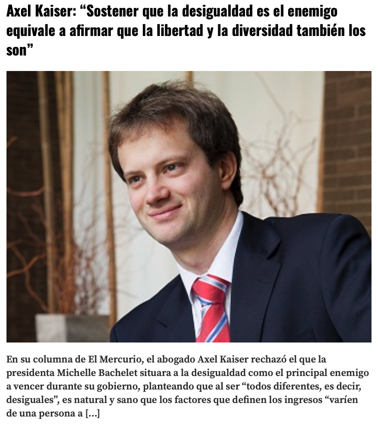
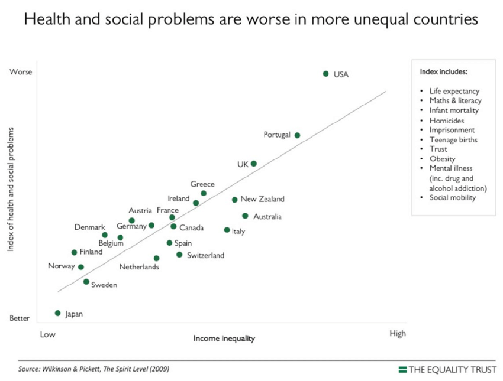

## ¿Importa la desigualad?

.pull-left[

]

.pull-right[

]

---
##¿Importa la desigualad?

.pull-left[

]

.pull-right[

   

]

## ¿Por qué estudiar las consecuencias?

- La desigualdad no es solo un número:  

  - Afecta salud, bienestar, cohesión y democracia.

- Pero: **Correlación ≠ Causalidad**.  
  - Ejemplo: Países con alta desigualdad tienen más crimen, pero eso no prueba causalidad.

---

## 1. Salud y Esperanza de Vida

 

.pull-left[
.bold[Asociación empírica]: 

- Sociedades más desiguales → peores indicadores de salud (Wilkinson & Pickett, 2009).  

- Ej.: EE.UU. vs. Suecia.

.bold[Mecanismos causales]:  

1. **Psicosocial**: Estrés crónico por comparación social (Wilkinson, 2005).  

2. **Material**: Acceso desigual a salud, alimentación, vivienda (Lynch et al., 2000).  

.bold[Confounders y mediadores]:  
- Nivel medio de ingreso, gasto en salud.
]

.pull-right[

]

---

## 2. Movilidad Social

 

**Asociación empírica**

- Alta desigualdad → menor movilidad intergeneracional ("Curva de Gatsby").

.bold[Mecanismos causales]:

1. **Inversión educativa desigual** (Chetty et al., 2014).  

2. **Segregación residencial y escolar**.  

.bold[Confounders y mediadores]:  

- Historia colonial, calidad institucional, tamaño del Estado.

---

## 3. Crimen y Violencia

 

.bold[Asociación empírica] 

- Mayor desigualdad se asocia a más homicidios (Fajnzylber et al., 2002).

.bold[Mecanismos causales]:

1. **Privación relativa**: Frustración por comparación social → agresión (Daly, 2016).  

2. **Material**: Menor vigilancia y oportunidades en zonas pobres (Sampson et al., 1997).  

.bold[Confounders y mediadores]: 

- Urbanización, narcotráfico, edad promedio, políticas de armas.

---

## 4. Felicidad y Bienestar Subjetivo

 

.bold[Asociación empírica]:

- Más desigualdad → menor felicidad media (Alesina et al., 2004).  

.bold[Mecanismos causales]:  

1. **Psicosocial**: Comparación social genera insatisfacción (Layte, 2011).  

2. **Material**: Acceso desigual a ocio, tiempo libre, seguridad económica.  

.bold[Confounders y mediadores]:  

- Cultura nacional, individualismo vs. colectivismo, religiosidad.

---
## 5. Estabilidad Política

 

.bold[Asociación empírica] 

- Sociedades desiguales tienen mayor riesgo de inestabilidad y conflicto (Boix, 2003).

.bold[Mecanismos causales]: 

1. **Captura institucional por élites** (Acemoglu & Robinson, 2008).  

2. **Descontento y protesta social** (Andersen, 2012).

.bold[Confounders y mediadores]:  
- Régimen político, desarrollo económico, densidad poblacional.

---

## Resumen: ¿Qué sabemos con certeza?

 

.pull-left[

✔ **Correlaciones**:  
- Salud, crimen, felicidad, Movilidad, conflicto asociado con desigualdad.

🧠 **Mecanismos plausibles**:  
- Psicosociales y materiales operan en paralelo.  

]

--

.pull-right[
.bold[Distinción clave]

- Correlación ≠ Causalidad  

- Mediadores ≠ Confounders  

- Evidencia observacional ≠ Experimentos naturales

]

---
class: inverse, center, middle

#Hasta la próxima clase!

 
Mauricio Bucca  
https://mebucca.github.io/

