class: inverse, center, middle

### "Consider two societies that have the same annual distribution of income. In one there is great mobility and change so that the position of particular families in the income hierarchy varies widely from year to year. In the other, there is great rigidity so that each family stays in the same position year after year. The one kind of inequality is a sign of dynamic change, social mobility, equality of opportunity; the other, of a status society" 

###(Friedman 1962)
---
class: center, middle
```{r, echo=F, message=F, warning=F,  out.width = '300px'}
library("tidyverse")
library("ineq")

theme_set(theme_bw())
options(digits=3, scipen = 100)
```

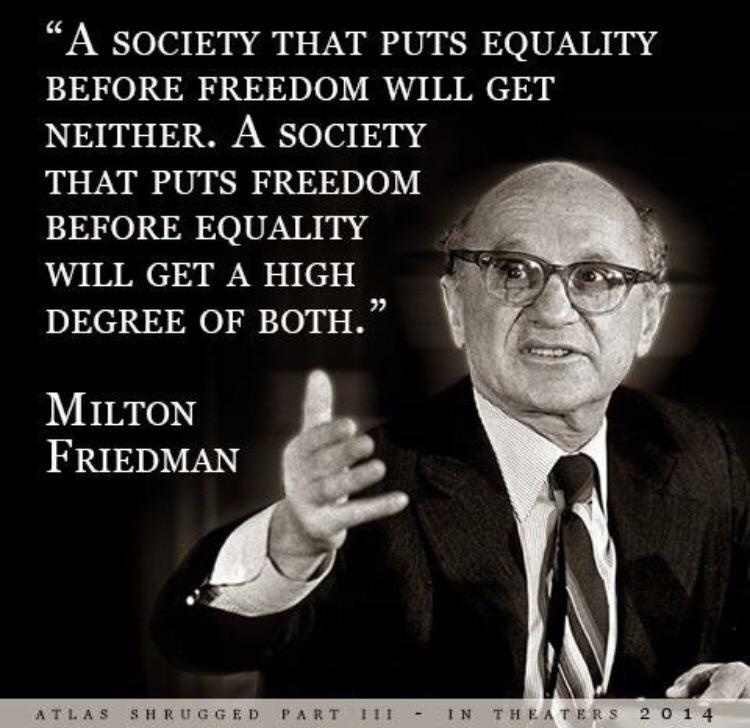
---
class: center, middle

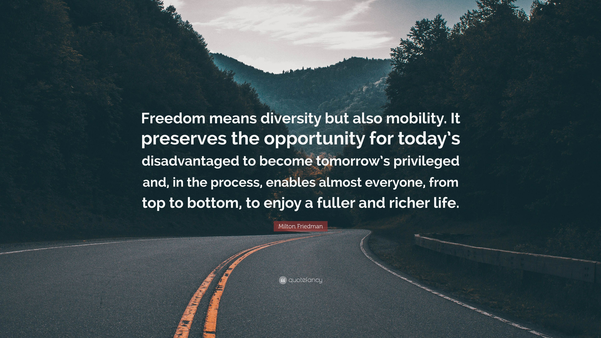

---
## Desigualdad y movilidad

- Desigualad y movilidad son analíticamente distintos y pueden ser pensados como independientes entre si

.pull-left[
### Sociedad A

|   **Padres**  |   **Hijos**   |
|:-------------:|:-------------:|
|  5  | 10  |
| 10  | 5   |
]

.pull-right[
### Sociedad B

|   **Padres**  |   **Hijos**   |
|:-------------:|:-------------:|
|  5  | 5  |
|  6  | 6  |
]

<br>
--


- Trade-off entre desigualdad y movilidad?

---
## Desigualdad y movilidad

.bold[Elasticidad intergeneracional (IGE)]

$$y^{\text{child}} = \alpha + \underbrace{\beta}_{\text{IGE}} y^{\text{par}} + \varepsilon$$
--

Equivalentemente

$$y^{\text{child}} = \alpha + \frac{\sigma_{y^{\text{child}}}}{\sigma_{y^{\text{par}}}}\underbrace{\rho}_{\text{IGC}} y^{\text{par}} + \varepsilon$$

* IGC: correlación intergeneracional. 

--

- Además, es posible que desigualdad y movilidad estén causalmente relacionados : $\rho(\text{desigualdad})$

---
# The Great Gatsby Curve

.pull-left[

]

--

.pull-left[

]

---
# The Great Gatsby Curve

.center[
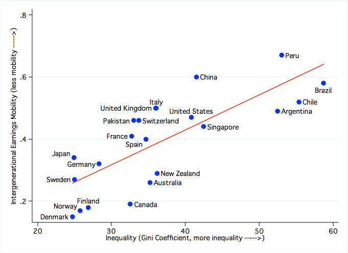 
Basado en Corak 2013
]


---
## 1) Retornos a la educación 

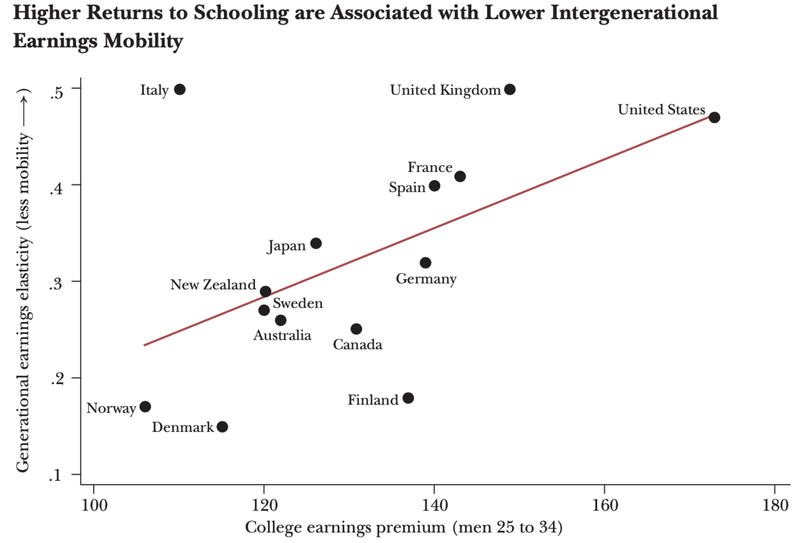

---
# 1) Retornos a la educación 

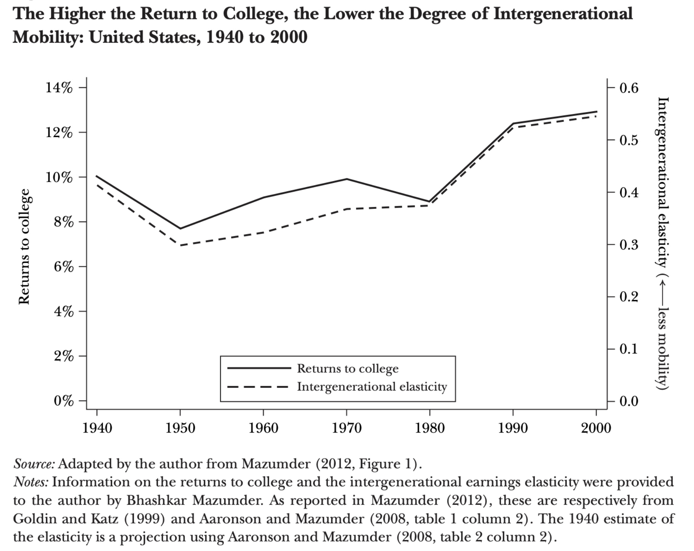

---
## 2) Inversión de la familias en el capital humano (e non solo) de sus hijos

<br>

- Más generalmente, "opportunity markets": los padres no pueden comprar directamente posición social para sus hijos, pero pueden comprar oportunidades indirectamente a través del acceso ventajoso a las escuelas, vecindarios e información que crean mérito, etc.

- Feedback loop entre desigualdad y movilidad. 


---
## 2) Inversión de la familias en el capital humano (e non solo) de sus hijos

Gastos:
.center[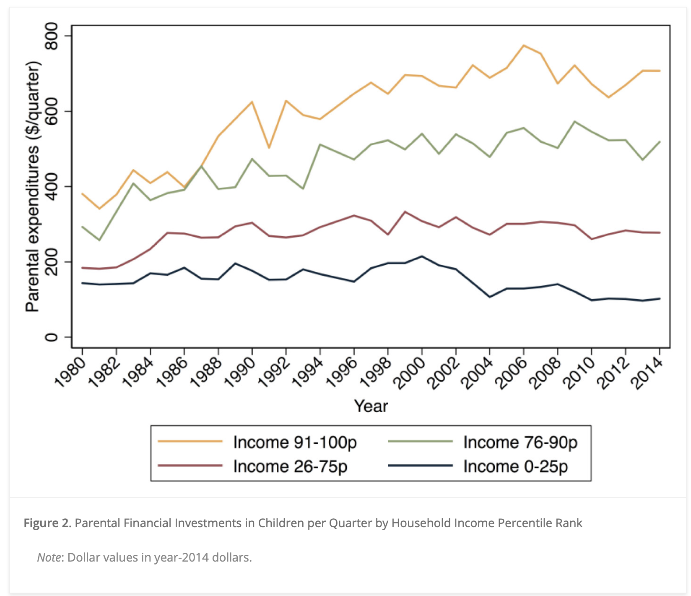]


---
## 2) Inversión de la familias en el capital humano (e non solo) de sus hijos

Tiempo:

.pull-left[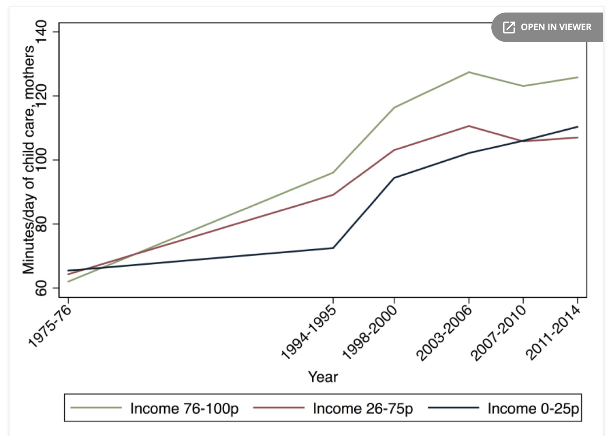]

.pull-right[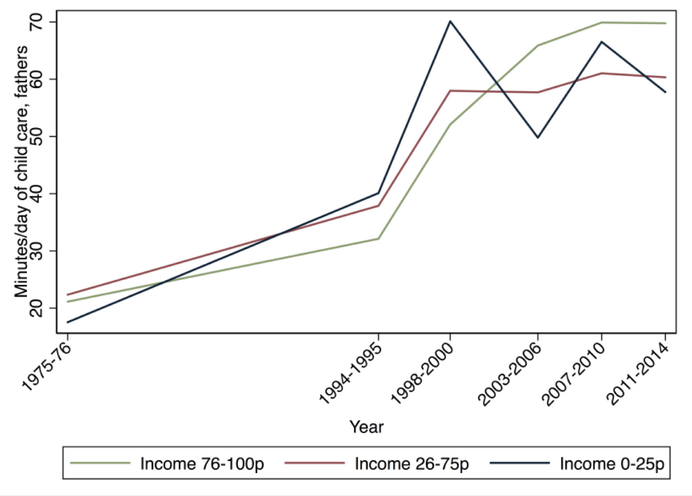]


---
## 2) Inversión de la familias en el capital humano (e non solo) de sus hijos

Income achievement gap:

.pull-left[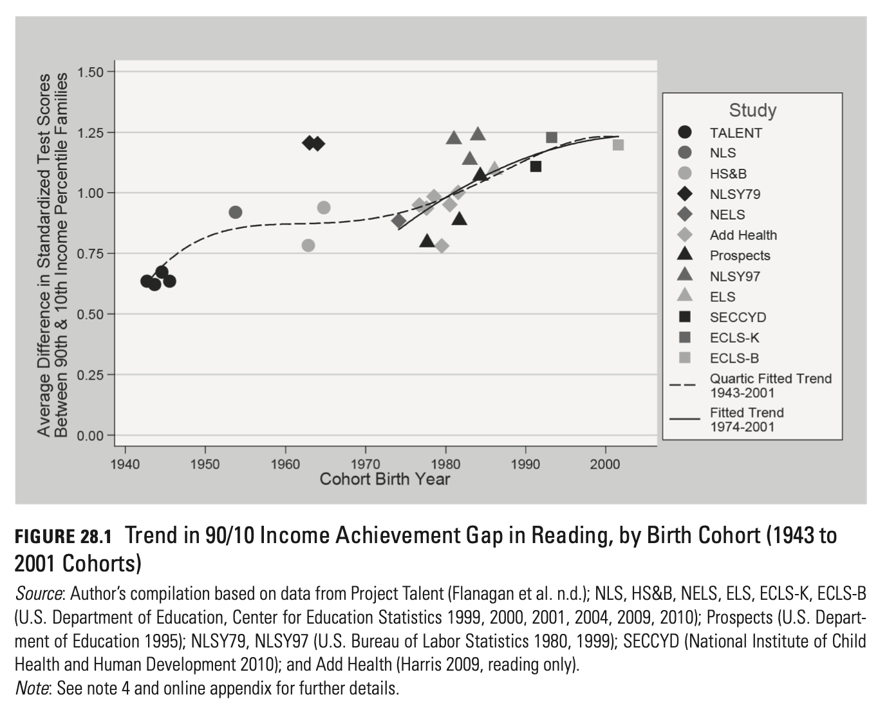]

.pull-right[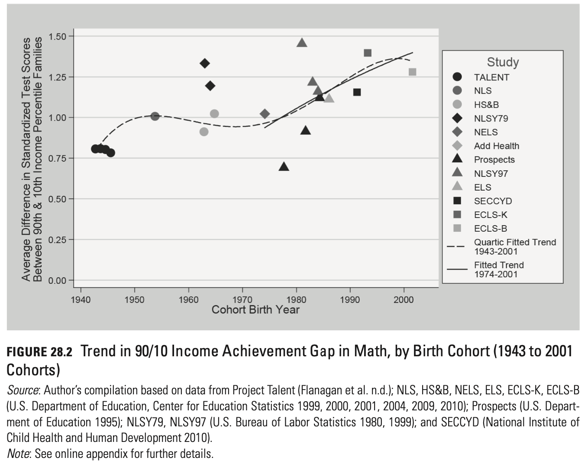]


---
## 2) Inversión de la familias en el capital humano (e non solo) de sus hijos

Income achievement gap:

.center[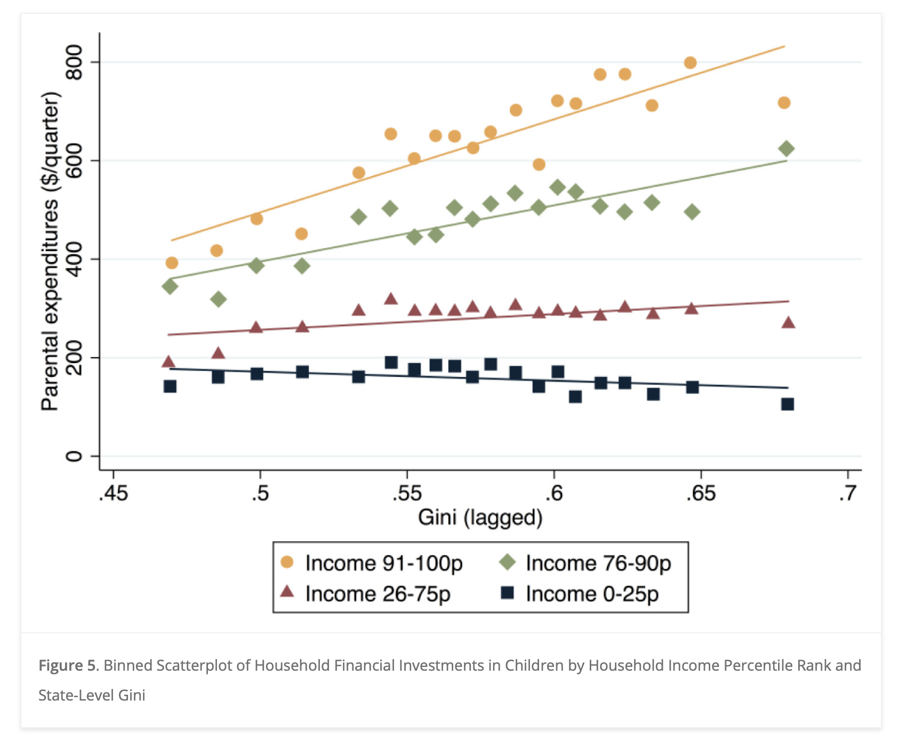]


---
## 3) Políticas redistributivas

<br>
Si la desigualdad y la movilidad están causalmente relacionadas, hay dos caminos no excluyentes para aumentar la movilidad social relativa (el peso de los "accidentes de la cuna")

<br>

- Redistribución: políticas que apunten a disminuir las desigualdades económicas y, por tanto, igualar la capacidad de pago por oportunidades (ej. impuesto progresivos).

- Decommodificación: sacar del mercado los servicios que son esenciales para el acceso a oportunidades (ej. educación pública de calidad).

---
## Material del curso

Todo el material del curso será almacenado y actualizado regularmente en repositorio `Github`:

<br>
.center[


https://github.com/mebucca/sdd_sol186s
]


---
class: inverse, center, middle

.huge[
**Hasta la próxima clase. Gracias!**
]

<br>
Mauricio Bucca <br>
https://mebucca.github.io/


