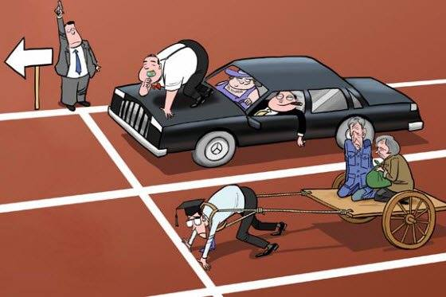

class: center, middle, inverse

## ¿Son justas la desigualdades? 
### Cuáles y cuanta
---
class: center, middle

.pull-left[]

.pull-right[]

---
## Mérito y esfuerzo vs suerte

---
## In-groups vs out-groups

deservingness
boundary-making

---
## Actual inequalities

- information
- perception: priviledge awareness/white awareness
- inter-contact: people read the world from their own situated position and extrapolate from their own experience’. 
  - sand, cote, newman   

  - bucca 2016
  
- income inequality

  -  starman
  
  
- social mobility (relativa, absoluta)

but mcCall

---
## Justificación del sistema

- feedback normativo
- ideología dominante, estructura-superestructura, cultural narratives  justify priviledge (meritocracy, land of opportubity, etc)

---
## Auto-interés o interés grupal

  - sesgos auto-intesados (molina et al), cita Weber
  
  

---
## Material del curso

Todo el material del curso será almacenado y actualizado regularmente en repositorio `Github`:

 
.center[

https://github.com/mebucca/sdd_sol186s
]

---
class: inverse, center, middle

.huge[
**Hasta la próxima clase. Gracias!**
]

 
Mauricio Bucca  
https://mebucca.github.io/

