class: center, middle, inverse

Desigualdades justas? Cuales? 

---
## Creencias sobre la desigualdad

.center[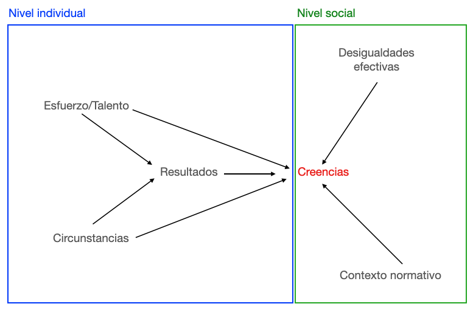]

---
## Desigualdades efectivas

Link entre las desigualdades efectivas en una sociedad y las creencias de los individuos acerca de las mismas (legitimidad). Dos alternativas:

--

.bold["Reflection hypothesis"]: Las creencias sobre la desigualdad tienden a describir las desigualdades efectivas en una sociedad

.center[]

En sociedades desiguales los ciudadanos estarían más preocupados por la desigualdad, considerarían que desigualdades reflejan fuerzas estructurales y demandarían corrección (redistribución).

---
## Desigualdades efectivas

Sin embargo ...

.pull-left[]

.pull-right[]

---
## Desigualdades efectivas

.center[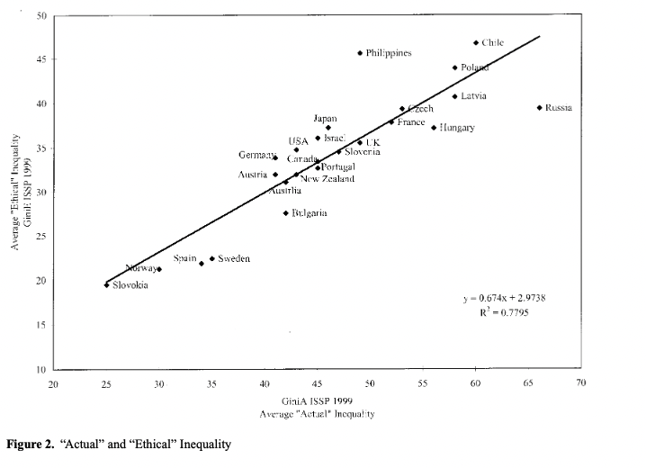]

---
## Desigualdades efectivas

.pull-left[.bold[Preocupación sobre la desigualdad]
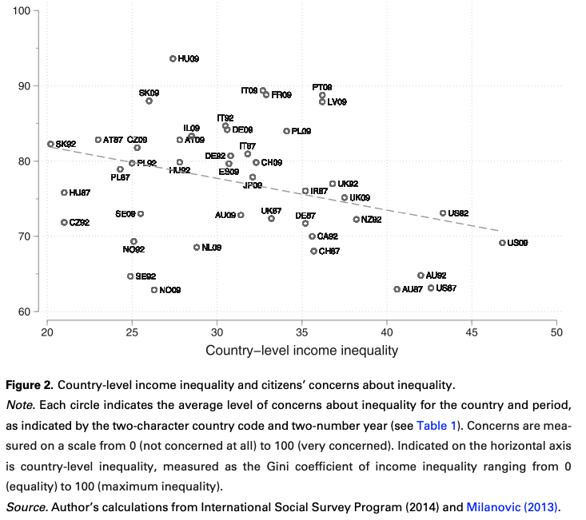]

.pull-right[.bold[Meritocracia vs. desigualdad estructural]
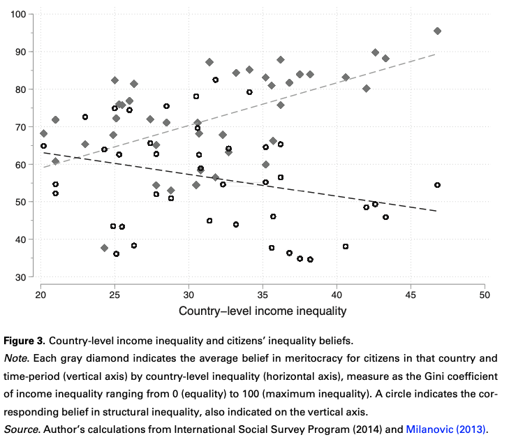]

---
## Desigualdades efectivas

.center[.bold[Creencias sobre la riqueza en LA]
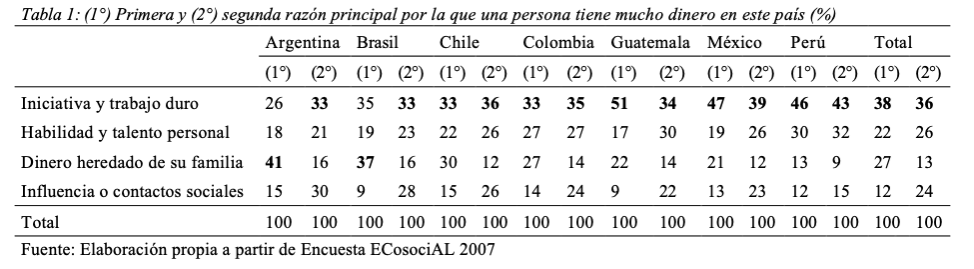]

---
## Desigualdades efectivas

.center[.bold[Creencias sobre la pobreza en LA]
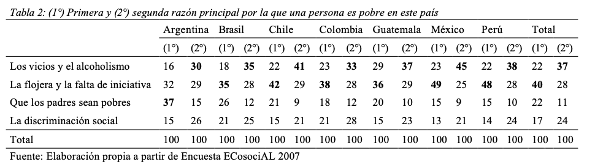]

---
## Desigualdades efectivas

 

¿Por qué?

 
--

Mijs 2021: .bold["inequality creates the social conditions for its legitimation".]

 
--

¿Cómo?

---
## Justificación del sistema

.pull-left[
.bold[Feedback normativo de las instituciones] 

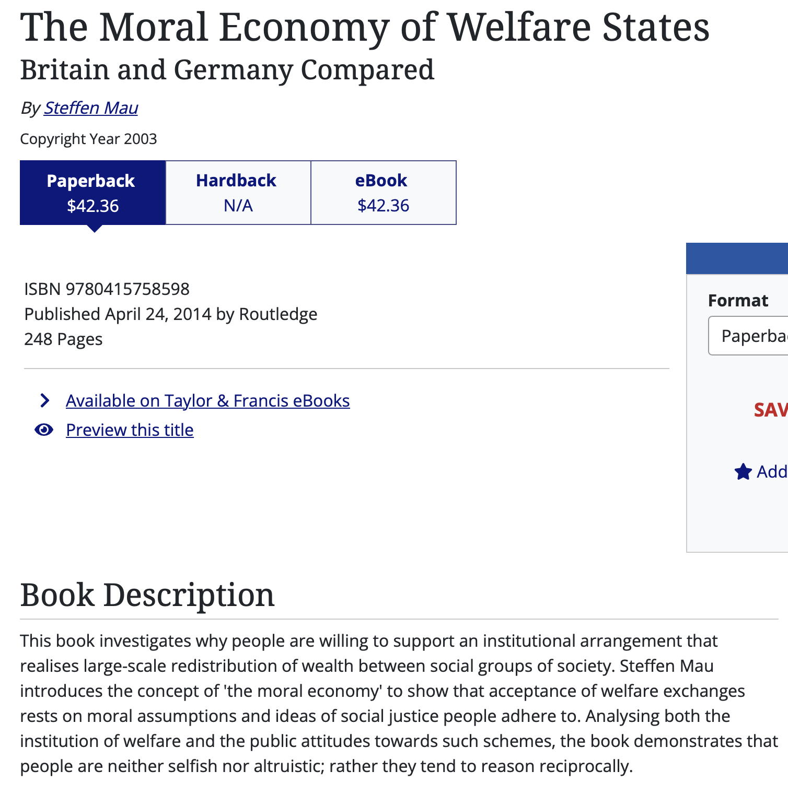
]

--

.pull-right[
.bold[Ideología dominante] 

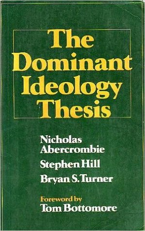
]

---
## Auto-interés o interés grupal

Narrativas culturales que justifican privilegio (meritocracia, tierra de las oportunidades, etc.) son desarrolladas y mantenidas por las elites.

 
--

> La más sencilla observación muestra que en todos los contrastes notables que se manifiestan en el destino de dos hombres, tanto en lo que se refiere a su salud como a su situación económica o social como en cualquier otros respecto, y por evidente que resulte el motivo puramente accidental de la diferencia, el que está mejor situado siente la urgente necesidad de considerar como legítima su propia situación como resultado de un .bold[mérito] y la ajena como producto de una .bold[culpa].

 
.pull-right[Max Weber, Economía y Sociedad] 

 
--

> Las ideas de la clase dominante son las ideas dominantes en cada época; o, dicho en otros términos, la clase que ejerce el poder material dominante en la sociedad es, al mismo tiempo, su poder espiritual dominante. La clase que tiene a su disposición los medios para la .bold[producción material] dispone con ello, al mismo tiempo, de los medios para la .bold[producción espiritual].

 
.pull-right[Karl Marx, La Ideología Alemana] 

---
## Auto-interés o interés grupal
 
- .bold[Self-serving biases] 
.center[

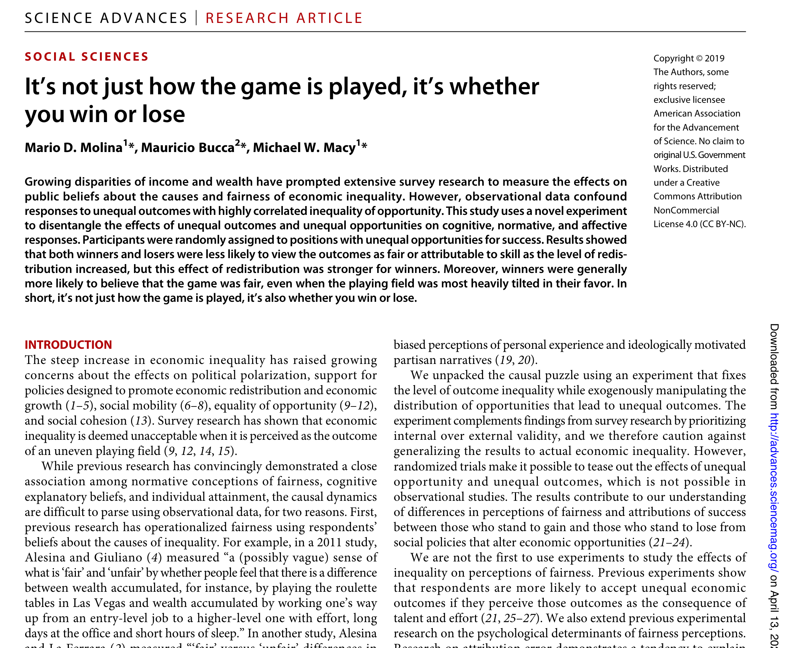
]

---
## Percepciones de la desigualdad

- .bold[Información:]
 

.pull-left[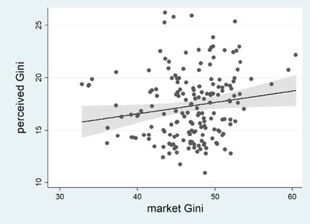]

--

.pull-right[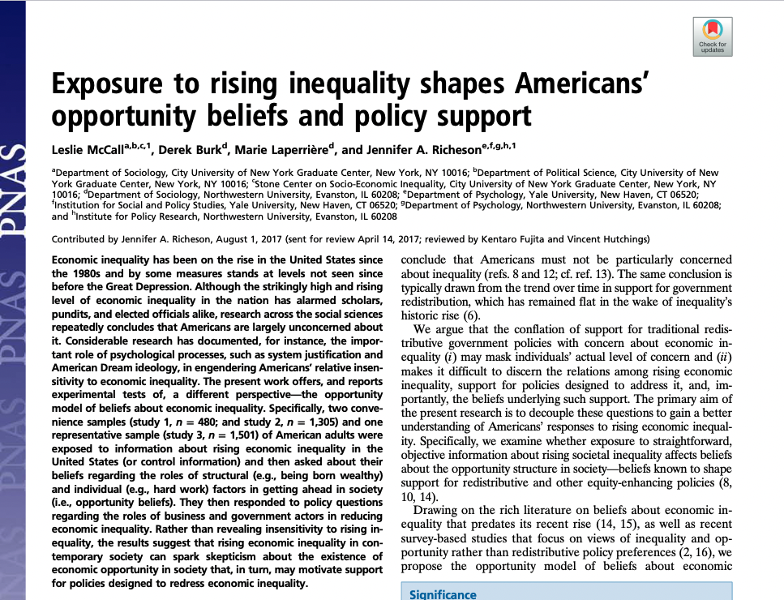]

---
## Percepciones de la desigualdad

- .bold[Exposición y contacto:]

Individuos leen el mundo desde una posición situada y extrapolan desde tu propia experiencia

.pull-left[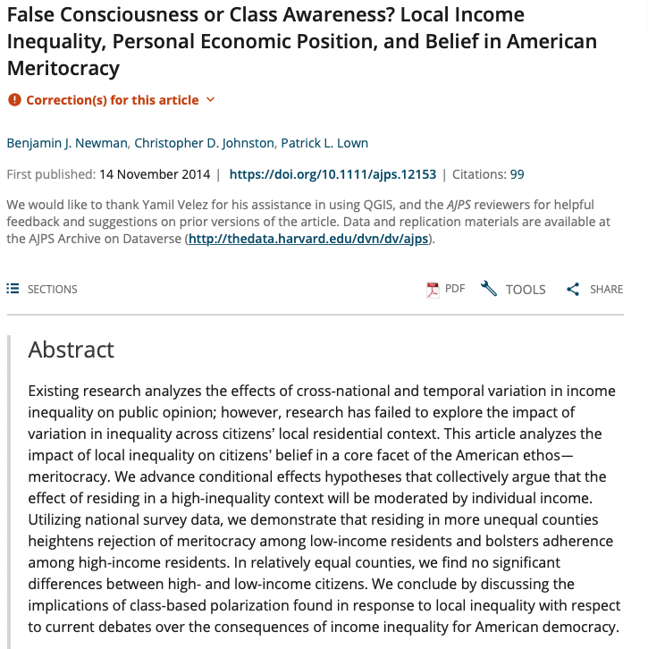]

--

.pull-right[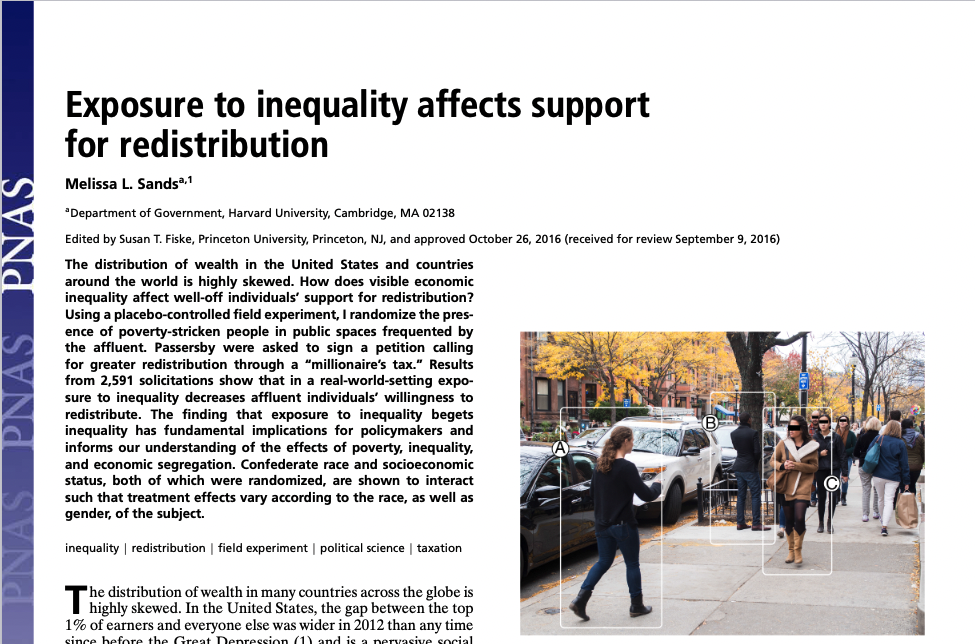]

---

## Creencias sobre la desigualdad

.center[]

---
## Material del curso

Todo el material del curso será almacenado y actualizado regularmente en repositorio `Github`:

 
.center[

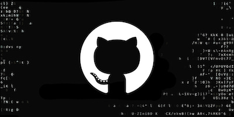

https://github.com/mebucca/sdd_sol186s
]

---
class: inverse, center, middle

.huge[
**Hasta la próxima clase. Gracias!**
]

 
Mauricio Bucca  
https://mebucca.github.io/

