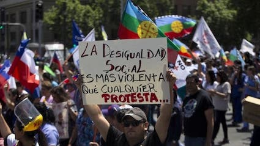

class: center, middle

.pull-left[]

.pull-right[]

---
## Creencias sobre la desigualdad

.center[]

---
## Desigualdades efectivas

Link entre las desigualdades efectivas en una sociedad y las creencias de los individuos acerca de las mismas (legitimidad). Dos alternativas:

--

.bold["Reflection hypothesis"]: Las creencias sobre la desigualdad tienden a describir las desigualdades efectivas en una sociedad

.center[]

En sociedades desiguales los ciudadanos estarían más preocupados por la desigualdad, considerarían que desigualdades reflejan fuerzas estructurales y demandarían corrección (redistribución).

---
## Desigualdades efectivas

Sin embargo ...

.pull-left[]

.pull-right[]

---
## Desigualdades efectivas

.pull-left[.bold[Preocupación sobre la desigualdad]
]

.pull-right[.bold[Meritocracia vs. desigualdad estructural]
]

---
## Desigualdades efectivas

.center[.bold[Creencias sobre la riqueza en LA]
]

---
## Desigualdades efectivas

.center[.bold[Creencias sobre la pobreza en LA]
]

---
## Desigualdades efectivas

por qué?

Mijs 2021: "inequality creates the social conditions for its legitimation".

como?

---
## In-groups vs out-groups

deservingness
boundary-making

---
## Actual inequalities

- information
- perception: priviledge awareness/white awareness
- inter-contact: people read the world from their own situated position and extrapolate from their own experience’. 

- income inequality

  -  starman
  
- social mobility (relativa, absoluta)

---
## Auto-interés o interés grupal

  - sesgos auto-intesados (molina et al), cita Weber

---
class: middle

> La más sencilla observación muestra que en todos los contrastes notables que se manifiestan en el destino de dos hombres, tanto en lo que se refiere a su salud como a su situación económica o social como en cualquier otros respecto, y por evidente que resulte el motivo puramente accidental de la diferencia, el que está mejor situado siente la urgente necesidad de considerar como legítima su propia situación como resultado de un .bold[“mérito”] y la ajena como producto de una .bold[“culpa”].

 
.pull-right[Max Weber, Economía y Sociedad (1922)] 

  
---
## Justificación del sistema

- feedback normativo
- ideología dominante, estructura-superestructura, cultural narratives  justify priviledge (meritocracy, land of opportubity, etc)

---
## Material del curso

Todo el material del curso será almacenado y actualizado regularmente en repositorio `Github`:

 
.center[

https://github.com/mebucca/sdd_sol186s
]

---
class: inverse, center, middle

.huge[
**Hasta la próxima clase. Gracias!**
]

 
Mauricio Bucca  
https://mebucca.github.io/

